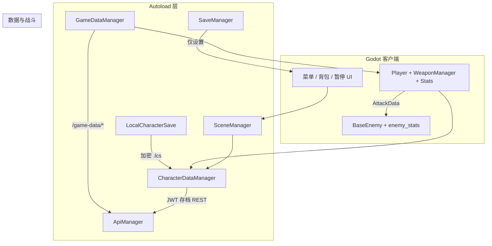

# Desastre Humano（Godot 客户端）

[中文](README.md) | [Español](README.es.md)

`docs/` 下专题正文为中文。西语版 [README.es.md](README.es.md) 翻译本页简介、结构与索引。

---

## 项目简介

**Desastre Humano** 是一款 Godot **4.6** 第三人称动作 RPG 客户端（Forward Plus，1920×1080）。玩家在关卡中探索、战斗与成长：切换第一/第三人称、使用武器与技能、管理背包与基因加点，通过 **SYNC** 突破等级上限；敌人由数据模板驱动（含近战 FSM、阶层与掉落）。支持**本地设置存档**与可选的**云端角色存档**（经 HTTP API 同步属性、背包、技能、基因与场景位置）。

单机可跑通场景与战斗；登录、静态配置拉取与云存档需游戏 API 在线（见下方「运行」）。

---

## 项目结构

```
Human Disaster/          ← 本仓库（Godot 工程根）
├── project.godot        # 工程配置、Autoload 注册
├── autoload/            # 全局单例（API、存档、场景、UI…）
├── Script/              # 玩法与 UI 脚本（按领域分子目录）
├── Scene/               # 场景：Player、敌人、菜单、关卡、技能特效…
├── resource/            # Resource：Stats、AttackData、武器/技能/基因数据…
├── 素材/                 # 美术、音频、UI 图
├── addons/xuanBag/      # 背包 UI 插件
├── shader_material/     # 着色器与材质
├── test/                # api_test、无头单元测试
└── docs/                # 各系统说明（专题 .md）
```

| 路径 | 说明 |
|------|------|
| `autoload/` | 不挂场景树的全局服务：`ApiManager`、`GameDataManager`、`CharacterDataManager`、`SceneManager`、`PauseManager` 等 |
| `Script/player/` | 玩家移动、相机、输入 |
| `Script/gun/` | 武器、弹道、`WorldWeapon` 拾取 |
| `Script/enemy/` | 敌人逻辑、部位受击、近战 FSM |
| `Script/SkillSystem/` | 技能实例与 AOE/治疗等效果 |
| `Script/menu/` | 登录、主菜单、设置、角色/技能面板 |
| `Script/map/` | 关卡与教程（如训练场） |
| `Scene/Player/` | 角色场景（如 `Fish_Man.tscn`） |
| `resource/stats/` | `Stats`：生命、等级、经验、抗性 |
| `resource/damageEvent/` | `AttackData` 统一伤害载体 |

`Script/` 子目录明细见 [docs/SCRIPT_LAYOUT.md](docs/SCRIPT_LAYOUT.md)。

---

## 架构概览

客户端采用 **Autoload 服务层 + 场景内组件** 分层：数据与网络在单例中，Player/敌人/武器在场景中协作。



**典型流程简述**

| 阶段 | 行为 |
|------|------|
| 启动 | `GameDataManager` 拉取物品/武器/技能/基因/敌人模板；`SaveManager` 读本地设置 |
| 登录 | `UserManager` + `ApiManager` 获取 JWT 与 `character_id` |
| 进关 | `CharacterDataManager.restore_to_player` 从快照或 API 恢复 Stats、背包、技能、基因 |
| 战斗 | 武器/技能生成 `AttackData` → 敌人 `Stats.take_damage`；击杀经 `ExperienceRewards` 加经验 |
| 切场景 | `SceneManager` 切场景前 `snapshot_before_scene_change`，新场景再 `restore_to_player` |
| 存档 | 暂停/退菜单时 `save_to_api`；定时写入 `LocalCharacterSave` 防闪退 |

战斗与 Stats 细节见 [docs/DAMAGE_SYSTEM.md](docs/DAMAGE_SYSTEM.md)；Autoload 顺序见 [docs/AUTOLOAD_AND_UI.md](docs/AUTOLOAD_AND_UI.md)。

---

## 运行

1. Godot 4.6 打开本目录下的 `project.godot`，F5 运行。
2. 仅本地试玩：无需数据库，部分功能（登录、云存档、静态 `/game-data/*`）不可用。
3. 完整联机存档：需单独部署 **游戏 API 服务**（FastAPI + PostgreSQL，默认 `http://127.0.0.1:8000`），客户端改 `autoload/APIManager.gd` 中的 `API_BASE_URL`。

| 项 | 说明 |
|----|------|
| Godot | 与 `project.godot` 中 `config/features` 一致（4.6） |
| 游戏 API | 默认端口 **8000**；路径与请求体见 [docs/APIManager.md](docs/APIManager.md) |
| 社区 App | 使用另一套 Spring API（**8080**），**不**经过本项目的 `APIManager.gd` |

**联调提示**：`API_BASE_URL` 填你机器上游戏 API 的可达地址（本机 `127.0.0.1`、局域网 IP 或端口转发后的地址）。改 API 或存档字段时，同步更新对应 `docs/` 专题文档。

### 默认键位

WASD 移动，Space 跳跃，Shift 冲刺，Ctrl 蹲伏，鼠标左键射击、右键瞄准，1/2 或滚轮换武器，B 背包，C 角色信息，Q/E/X 技能，F 交互。

### 测试

- `test/api_test.tscn`（需游戏 API 已启动；本地可设 `TEST_SKIP_EMAIL_VERIFY=1`）
- 说明：[docs/TESTING.md](docs/TESTING.md)

---

## 文档索引

**系统说明只看本节与 `docs/` 下各专题文件**；不要在多篇模块文档之间来回跳转。Autoload 列表见 [docs/AUTOLOAD_AND_UI.md](docs/AUTOLOAD_AND_UI.md)。

### 怎么读

1. **先查下表「主题 → 主文档」**，只打开对应那一篇。
2. **一篇文档 = 一个主题的主说明**；其它文件若提到同一主题，最多一句摘要 + 链回本节表格。
3. **不要**用 [docs/CHARACTER_AND_WEAPON_OVERVIEW.md](docs/CHARACTER_AND_WEAPON_OVERVIEW.md) 当权威来源——那是速览；细节以分项文档为准。
4. 改代码后只更新**该主题主文档**；若 REST 路径或 JSON 字段有变，同步改 [docs/APIManager.md](docs/APIManager.md) 与相关专题。

### 主题 → 主文档（权威分工）

| 主题 | 主文档 | 不写在这里的内容 |
|------|--------|------------------|
| 文档入口 | **本页** | — |
| Autoload / 暂停 / UI 快捷键 | [docs/AUTOLOAD_AND_UI.md](docs/AUTOLOAD_AND_UI.md) | 各玩法细节 |
| `Script/` 目录 | [docs/SCRIPT_LAYOUT.md](docs/SCRIPT_LAYOUT.md) | 各系统逻辑 |
| HTTP / JWT / REST 路径 | [docs/APIManager.md](docs/APIManager.md) | 存档编排 |
| 角色快照 / 云存档编排 | [docs/CharacterDataManager.md](docs/CharacterDataManager.md) | 伤害公式 |
| 本地快存 / 版本号 | [docs/LOCAL_AND_CLOUD_SAVE.md](docs/LOCAL_AND_CLOUD_SAVE.md) | 设置档 |
| 仅游戏设置存档 | [docs/SaveManager.md](docs/SaveManager.md) | 角色进度 |
| 静态 `/game-data/*` | [docs/GameDataManager.md](docs/GameDataManager.md) | 敌人运行时 |
| 背包 | [docs/INVENTORY.md](docs/INVENTORY.md) | 武器 |
| 武器 | [docs/WEAPON_SYSTEM.md](docs/WEAPON_SYSTEM.md) | 技能 |
| 技能 | [docs/SKILL_SYSTEM.md](docs/SKILL_SYSTEM.md) | 基因 |
| 相机 / 移动 | [docs/PLAYER_CAMERA_AND_MOVEMENT.md](docs/PLAYER_CAMERA_AND_MOVEMENT.md) | 存档字段 |
| 物理层 / 掩码 | [docs/COLLISION_LAYERS.md](docs/COLLISION_LAYERS.md) | 伤害 |
| 伤害 / Stats / AttackData | [docs/DAMAGE_SYSTEM.md](docs/DAMAGE_SYSTEM.md) | 敌人 AI、近战判定 |
| 敌人（数据 + 运行时） | [docs/ENEMY_SYSTEM.md](docs/ENEMY_SYSTEM.md) | 伤害公式全文 |
| 经验 / 等级 / SYNC 突破 | [docs/EXPERIENCE_SYSTEM.md](docs/EXPERIENCE_SYSTEM.md) | 基因 |
| 基因 / 子基因 | [docs/GENE_SYSTEM.md](docs/GENE_SYSTEM.md) | 敌人 AI |
| 环境危害（火/毒等） | [docs/HAZARD_SYSTEM_ALIGNMENT.md](docs/HAZARD_SYSTEM_ALIGNMENT.md) | 通用伤害 |
| 角色菜单 / SYNC UI | [docs/CHARACTER_MENU.md](docs/CHARACTER_MENU.md) | Stats 公式 |
| 问题台账 | [docs/PROJECT_ISSUES_AND_FIXES.md](docs/PROJECT_ISSUES_AND_FIXES.md) | 教程文 |
| Godot 测试 | [docs/TESTING.md](docs/TESTING.md) | 服务端 pytest |

**速览（非权威）**：[docs/CHARACTER_AND_WEAPON_OVERVIEW.md](docs/CHARACTER_AND_WEAPON_OVERVIEW.md)

### 全部模块文件（按名称）

| 文档 | 一句话 |
|------|--------|
| [docs/AUTOLOAD_AND_UI.md](docs/AUTOLOAD_AND_UI.md) | Autoload 顺序、PauseManager、UIManager |
| [docs/SCRIPT_LAYOUT.md](docs/SCRIPT_LAYOUT.md) | `Script/` 子目录说明 |
| [docs/APIManager.md](docs/APIManager.md) | HTTP 客户端封装与路由表 |
| [docs/CharacterDataManager.md](docs/CharacterDataManager.md) | restore / snapshot / save_to_api |
| [docs/LOCAL_AND_CLOUD_SAVE.md](docs/LOCAL_AND_CLOUD_SAVE.md) | `.lcs` 本地快存与云端同步 |
| [docs/SaveManager.md](docs/SaveManager.md) | `user://` 设置档 |
| [docs/GameDataManager.md](docs/GameDataManager.md) | 启动拉取 game-data 与查询 API |
| [docs/INVENTORY.md](docs/INVENTORY.md) | xuanBag / InventoryManager |
| [docs/WEAPON_SYSTEM.md](docs/WEAPON_SYSTEM.md) | WeaponManager、WorldWeapon、弹道 |
| [docs/SKILL_SYSTEM.md](docs/SKILL_SYSTEM.md) | SkillManager、SkillLookup、效果场景 |
| [docs/PLAYER_CAMERA_AND_MOVEMENT.md](docs/PLAYER_CAMERA_AND_MOVEMENT.md) | 一/三人称、PlayerViewPaths |
| [docs/COLLISION_LAYERS.md](docs/COLLISION_LAYERS.md) | `CollisionLayers` 与物理层命名 |
| [docs/DAMAGE_SYSTEM.md](docs/DAMAGE_SYSTEM.md) | AttackData、Stats.take_damage |
| [docs/ENEMY_SYSTEM.md](docs/ENEMY_SYSTEM.md) | 敌人数据、FSM、近战、生成 |
| [docs/EXPERIENCE_SYSTEM.md](docs/EXPERIENCE_SYSTEM.md) | 经验曲线、SYNC 门闸 |
| [docs/GENE_SYSTEM.md](docs/GENE_SYSTEM.md) | GeneManager、子基因、API |
| [docs/HAZARD_SYSTEM_ALIGNMENT.md](docs/HAZARD_SYSTEM_ALIGNMENT.md) | Hazard 与四抗性 |
| [docs/CHARACTER_MENU.md](docs/CHARACTER_MENU.md) | 属性面板、突破按钮 |
| [docs/CHARACTER_AND_WEAPON_OVERVIEW.md](docs/CHARACTER_AND_WEAPON_OVERVIEW.md) | 导读速览 |
| [docs/PROJECT_ISSUES_AND_FIXES.md](docs/PROJECT_ISSUES_AND_FIXES.md) | 已知问题与修复记录 |
| [docs/TESTING.md](docs/TESTING.md) | api_test、无头单测 |
