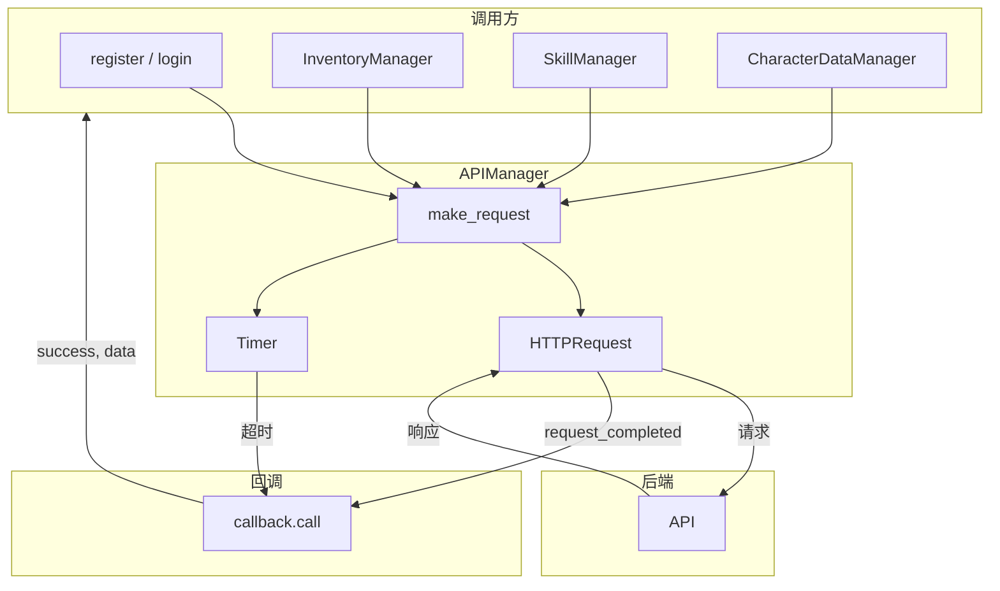

# APIManager 说明文档
[← 文档索引](../README.md#文档索引)

APIManager 是项目中用于与后端 HTTP API 通信的全局单例（autoload 中注册为 `ApiManager`），负责发送请求、携带 JWT、超时处理与统一回调。

---

## 一、基本配置

| 项 | 说明 |
|----|------|
| **脚本路径** | `autoload/APIManager.gd` |
| **Autoload 名称** | `ApiManager`（见 `project.godot`） |
| **API 根地址** | `API_BASE_URL = "http://127.0.0.1:8000"`（联调时改为当前环境可达的游戏 API 地址：本机、局域网 IP 或端口转发后的 URL） |
| **请求超时** | `timeout_sec = 25.0` 秒 |
| **认证方式** | 请求头 `Authorization: Bearer <jwt_token>`，登录成功后自动保存 `jwt_token` |

---

## 二、API 请求数据流



---

## 三、核心方法

### 3.1 通用请求：`make_request`

```gdscript
func make_request(endpoint: String, method: int = HTTPClient.METHOD_GET, data: Dictionary = {}, callback: Callable = Callable()) -> void
```

- **endpoint**：相对路径，会拼在 `API_BASE_URL` 后（如 `"/login"` → `http://127.0.0.1:8000/login`）。
- **method**：`HTTPClient.METHOD_GET` / `METHOD_POST` / `METHOD_PUT` / `METHOD_DELETE` 等。
- **data**：请求体字典，非 GET 且非空时会用 `JSON.stringify(data)` 发送，请求头为 `Content-Type: application/json`。
- **callback**：请求完成时调用 `callback.call(success: bool, response_data)`。  
  - `success`：HTTP 状态码 2xx 为 true。  
  - `response_data`：解析后的 JSON（若解析失败则传 `{"message": "数据解析错误"}` 等）。  
  - 请求失败、超时、解析错误时也会调用 callback，此时 `success == false`。
- **require_auth**：是否携带 JWT。静态数据接口（game-data）设为 `false`，无需 token。

行为摘要：

- **并行请求**：每次调用 `make_request` 会创建独立的 `HTTPRequest` 节点，请求完成后自动释放。支持多请求并发（如 GameDataManager 同时拉取 items/skills/genes）。
- 若响应为 2xx 且为字典且包含 `"access_token"`，会自动把 `response_data["access_token"]` 写入 `jwt_token`，后续请求会带此 token。
- 超时通过内部 `Timer` 实现：超时后取消请求并调用 `callback.call(false, {"message": "请求超时"})`。

---

## 四、已实现的用户相关 API

| 方法 | 路径 | 方法 | 说明 |
|------|------|------|------|
| `register(username, password, email, callback)` | `/register` | POST | 用户注册 |
| `send_verification_code(email, callback)` | `/send_verification` | POST | 发送验证码 |
| `verify_email(email, code, callback)` | `/verify_email` | POST | 邮箱验证 |
| `login(username, password, callback)` | `/login` | POST | 用户登录（成功后会保存 `access_token` 到 `jwt_token`） |
| `get_me(callback)` | `/me` | GET | 获取当前用户信息（带 token，回调中返回 `success` 与 `data`） |

---

## 五、角色 API（使用角色 ID）

| 方法 | 路径 | HTTP | 说明 |
|------|------|------|------|
| `list_characters(callback)` | `/characters` | GET | 获取角色列表 |
| `create_character(char_name, server_id, character_class, callback)` | `/characters` | POST | 创建角色 |
| `save_inventory(character_id, slots, callback)` | `/characters/{id}/inventory` | POST | 保存背包 |
| `load_inventory(character_id, callback)` | `/characters/{id}/inventory` | GET | 加载背包 |
| `save_skills(character_id, skills_dict, callback)` | `/characters/{id}/skills` | POST | 保存技能 |
| `load_skills(character_id, callback)` | `/characters/{id}/skills` | GET | 加载技能 |
| `load_stats(character_id, callback)` | `/characters/{id}/stats` | GET | 加载角色属性 |
| `save_stats(character_id, stats_dict, callback)` | `/characters/{id}/stats` | POST | 保存角色属性（含 `gene_points`、`experience`、`sync_breakthroughs_completed`、`loadout`、`scene_state`、四抗性等，与 `CharacterStatsSaveRequest` / `Stats.save_to_dict()` 对齐） |
| `load_genes(character_id, callback)` | `/characters/{id}/genes` | GET | 加载角色基因（响应含 `genes` 与 `gene_modules`） |
| `save_genes(character_id, payload, callback)` | `/characters/{id}/genes` | POST | 保存角色基因（`payload` 为 `{genes, gene_modules}` 或旧版仅 genes 数组） |
| `save_scene_state(character_id, data, callback)` | `/characters/{id}/scene_state` | POST | 保存场景状态（`scene_path`, `position`, `rotation_y`；可选 `collected_pickables`，与 `SceneStateSaveRequest` 一致） |
| `load_scene_state(character_id, callback)` | `/characters/{id}/scene_state` | GET | 加载场景状态（响应含 `collected_pickables` 数组，字符串 ID） |
| `unlock_gene(character_id, gene_id, callback)` | `/characters/{id}/genes/unlock` | POST | 解锁基因（扣基因点；响应含 `gene_points` 余额） |
| `upgrade_gene(character_id, gene_id, callback)` | `/characters/{id}/genes/upgrade` | POST | 升级基因（扣基因点；响应含 `gene_points`） |
| `unlock_gene_module(character_id, module_id, callback)` | `/characters/{id}/gene-modules/unlock` | POST | 解锁子基因（扣点 + `unlock_materials`） |
| `upgrade_gene_module(character_id, module_id, callback)` | `/characters/{id}/gene-modules/upgrade` | POST | 升级子基因（扣点 + 按级材料） |
| `toggle_gene(character_id, gene_id, is_active, callback)` | `/characters/{id}/genes/toggle` | POST | 激活/停用基因 |

## 六、静态游戏数据 API（无需 token）

| 方法 | 路径 | HTTP | 说明 |
|------|------|------|------|
| `get_game_data_items(callback)` | `/game-data/items` | GET | 获取物品静态数据 |
| `get_game_data_skills(callback)` | `/game-data/skills` | GET | 获取技能静态数据 |
| `get_game_data_genes(callback)` | `/game-data/genes` | GET | 获取基因静态数据（每条含 `modules[]` 子基因定义） |
| `get_game_data_enemies(callback)` | `/game-data/enemies` | GET | 获取敌人模板（含 `enemy_category`、`combat_tags`） |

---

## 七、使用示例

```gdscript
# 登录
ApiManager.login("myuser", "mypass", func(success, data):
    if success:
        print("登录成功，token 已保存")
    else:
        print("失败: ", data.get("message", "未知错误"))
)

# 获取当前用户信息
ApiManager.get_me(func(success, data):
    if success:
        var character_id = str(data.get("character_id", data.get("id", "1")))
        UserManager.current_character_id = character_id
)

# 保存背包
ApiManager.save_inventory(character_id, InventoryManager.get_serializable_inventory(), func(success, resp):
    if success:
        print("背包保存成功")
)

# 读取背包
ApiManager.load_inventory(character_id, func(success, resp):
    if success and resp.has("slots"):
        InventoryManager.load_serializable_inventory(resp["slots"])
)

# 保存技能
ApiManager.save_skills(character_id, SkillManager.save_skills_data(), func(success, resp):
    if success:
        print("技能保存成功")
)

# 读取技能
ApiManager.load_skills(character_id, func(success, resp):
    if success and resp.has("skills"):
        SkillManager.load_skills_data(resp["skills"])
)

# 加载/保存角色属性（通常由 CharacterDataManager 调用）
ApiManager.load_stats(character_id, func(success, resp):
    if success and resp is Dictionary and player_stats:
        player_stats.load_from_dict(resp)
)
ApiManager.save_stats(character_id, player_stats.save_to_dict(), func(success, resp): ...)
```

---

## 八、API 测试（api_test）

`test/api_test.gd` 配合 **`test/api_test.tscn`** 用于：

1. **连通性**：客户端到后端 `API_BASE_URL` 是否可达（网络、防火墙、服务是否监听 `0.0.0.0`）。  
2. **后端对接**：各路径的请求/响应是否与当前 FastAPI 路由及 JSON 字段一致（契约校验）。  
3. **架构一致**：所有调用走本模块 **`ApiManager` 封装**（与 `CharacterDataManager` / `GameDataManager` 相同入口），确保联调结果能代表正式游戏内的 API 使用方式。

运行 `test/api_test.tscn` 后按控制台步骤查看通过/失败。覆盖路径如下：

| 序号 | 路径 | 说明 |
|------|------|------|
| 1 | POST /register | 注册 |
| 2 | POST /login | 登录 |
| 3 | GET /me | 当前用户 |
| 4 | GET /characters | 角色列表 |
| 4b | POST /characters | 创建角色（无角色时） |
| 5-10 | /characters/{id}/inventory, skills, stats | 背包/技能/属性 加载与保存 |
| 10a | /characters/{id}/scene_state | 场景状态（场景路径、位置、朝向） |
| 10b | /characters/{id}/genes | 基因加载/保存（可选） |
| 11-14 | GET /game-data/items, skills, genes, enemies | 静态数据（无需 token） |
| 14 | POST /send_verification | 发送验证码 |
| 15 | POST /verify_email | 邮箱验证 |

---

## 九、注意事项

1. **修改服务器地址**：改 `API_BASE_URL` 常量为你的后端地址。
2. **CharacterDataManager**：角色进度 REST 由 [CharacterDataManager.md](CharacterDataManager.md) 编排（本文件只列路径与请求体）。
3. **JWT 持久化**：当前仅在内存中保存 `jwt_token`，进程结束即丢失；若需持久化，可在登录成功后自行写入 `user://` 或通过 SettingData/SaveManager 等保存。
4. **线程/节点**：`HTTPRequest` 在 `_ready` 中创建并挂到 APIManager 下，回调在主线程执行，可直接操作场景树。

以上为 APIManager 的完整说明。
