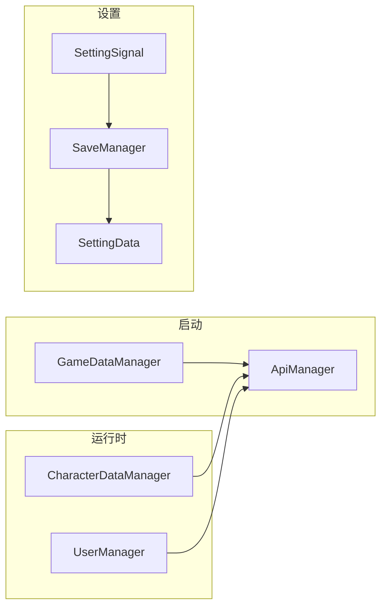

# Autoload 与 UI 流程说明
[文档索引](README.md) | [Índice](README.es.md)

本文档概括 `project.godot` 中注册的 Autoload 职责、依赖顺序及与场景/UI 的协作关系。细粒度 API 见各模块专文（如 `APIManager.md`、`CharacterDataManager.md`）。

---

## 1. 加载顺序（节选）

顺序影响 `_ready` 与 `call_deferred`：靠前的节点先初始化。

| 顺序 | 名称 | 脚本/场景 | 职责摘要 |
|------|------|-----------|----------|
| 1 | SettingData | SettingData.gd | 运行时设置状态、默认值 |
| 2 | SettingSignal | SettingSignal.gd | 设置变更/加载信号 |
| 3 | SaveManager | SaveManager.gd | 设置加密写入 `user://SettingsData` |
| 4 | LocalCharacterSave | LocalCharacterSave.gd | 本地角色快存（与云端存档配合） |
| 5 | ApiManager | APIManager.gd | HTTP、JWT、超时 |
| 6 | GameDataManager | GameDataManager.gd | 静态 items/weapons/skills/genes/enemies |
| … | GeneManager / CharacterDataManager / … | — | 见下节 |
| … | SceneManager | SceneManager.gd | 场景切换、UI 工厂路径 |
| … | GBMssage | GlobalMessage.tscn | 全局文字提示（autoload 名为 **GBMssage**，历史拼写） |
| … | SignalBus | SignalBus.gd | 占位脚本（信号均为注释，未启用） |

完整列表以 `project.godot` → `[autoload]` 为准。

---

## 2. 核心数据流（简图）

- **登录后**：`UserManager` 持有 `current_character_id`，`CharacterDataManager` 据此拉取/快照背包、技能、属性、基因、场景状态。
- **切场景**：`SceneManager._change_scene_internal` 先调用 `CharacterDataManager.snapshot_before_scene_change()`，再进入加载场景；新场景 `Player` 就绪后 `restore_to_player`。

---

## 3. PauseManager 与 UIManager

- **PauseManager**：维护暂停状态栈（菜单、背包、对话等），控制 `get_tree().paused` 与鼠标模式；关闭暂停菜单时触发 `CharacterDataManager.save_to_api()`；退回主菜单前异步完整存档。
- **UIManager**：快捷键切换「背包 / 角色信息」等 UI，通过 `SceneManager.create_ui` 实例化；关闭时 `ui_closed` → PauseManager 同步 `pop_state`。
- **登录场景**：`UIManager._is_ui_allowed()` 在 `UserLogin` 组场景下屏蔽游戏内 UI 快捷键，避免未进游戏误触。

---

## 4. SignalBus

- 当前为**占位**：`SignalBus.gd` 内信号与 `debug_print_connections` 均保留为注释，不参与运行。
- 若将来要启用全局总线，取消注释并统一在各模块 `emit` 即可。

---

## 5. 相关文档

| 文档 | 内容 |
|------|------|
| [README.md](README.md) | 模块索引 |
| [APIManager.md](APIManager.md) | HTTP 与接口列表 |
| [CharacterDataManager.md](CharacterDataManager.md) | 存档与快照 |
| [SaveManager.md](SaveManager.md) | 设置文件格式与职责边界 |

客户端测试命令见仓库根目录 [TESTING.md](../../StarshipBackend/docs/TESTING.md)（无头单元测试、`api_test.tscn`）。
