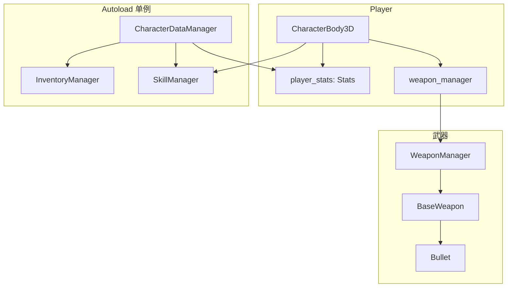

# 角色与武器 — 导读速览

[← 文档索引](../README.md#文档索引)

> **注意：本文不是权威说明。** 实现细节与扩展请以主题主文档为准：[WEAPON_SYSTEM.md](WEAPON_SYSTEM.md)、[PLAYER_CAMERA_AND_MOVEMENT.md](PLAYER_CAMERA_AND_MOVEMENT.md)、[SKILL_SYSTEM.md](SKILL_SYSTEM.md)、[DAMAGE_SYSTEM.md](DAMAGE_SYSTEM.md)、[CharacterDataManager.md](CharacterDataManager.md)。分工表见 [../README.md](../README.md#主题--主文档权威分工)。

本文档仅保留**一张总览图**与最短路径说明，避免与分项文档重复维护。

---

## 角色与系统关系总览

---

## 最短路径（改功能时打开哪篇）

| 要改什么 | 打开 |
|----------|------|
| 射击 / 换弹 / 拾取枪 | [WEAPON_SYSTEM.md](WEAPON_SYSTEM.md) |
| 技能栏 / 中文技能名存档 | [SKILL_SYSTEM.md](SKILL_SYSTEM.md) |
| 移动 / 相机 | [PLAYER_CAMERA_AND_MOVEMENT.md](PLAYER_CAMERA_AND_MOVEMENT.md) |
| 扣血 / 暴击 / 抗性 | [DAMAGE_SYSTEM.md](DAMAGE_SYSTEM.md) |
| 登录后进关数据 | [CharacterDataManager.md](CharacterDataManager.md) |
| 教程门控 | [AUTOLOAD_AND_UI.md](AUTOLOAD_AND_UI.md)（TutorialManager）+ [CharacterDataManager.md](CharacterDataManager.md)（`tutorial_completed`） |
