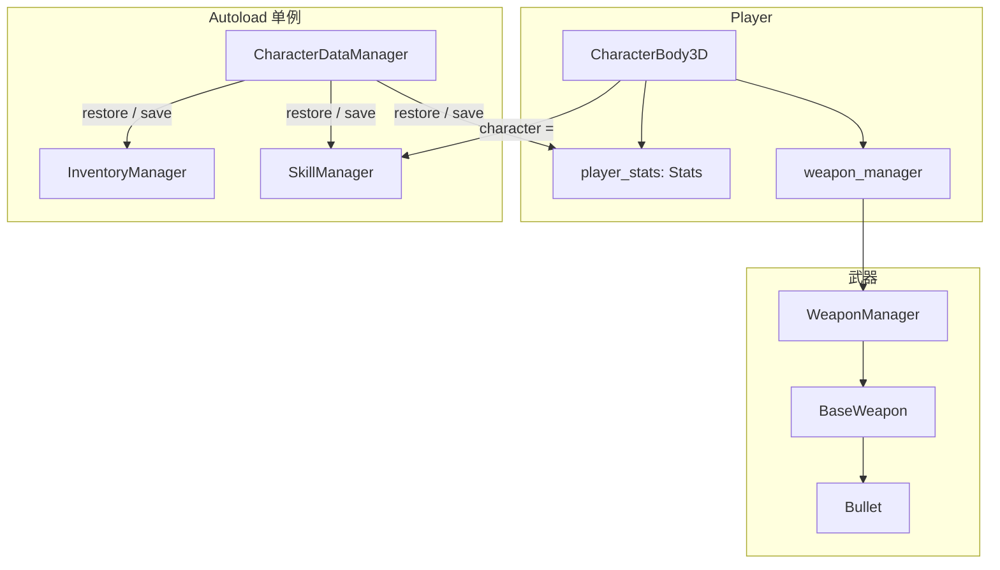

# 角色与武器系统 — 理解摘要

本文档汇总对项目中**角色（Player）**与**武器系统**的阅读与理解，便于后续扩展教程、技能或新武器时保持一致性。

---

## 角色与系统关系总览

---

## 一、角色（Player）整体结构

### 1.1 场景与脚本

| 项目 | 说明 |
|------|------|
| **场景** | `Scene/Player/Fish_Man.tscn`，根节点 `FishMan`（`CharacterBody3D`，分组 `Player`） |
| **脚本** | `Script/player/Player.gd`，挂载在根节点上 |
| **属性资源** | `@export var player_stats: Stats`（如 `resource/stats/player_stats.tres`），用于最大生命、等级、防御等 |

### 1.2 节点结构概览

- **firstperson**：第一人称链 `nek → head → CameraRigFP（子场景）→ FPCamera（Camera3D）`
  - 下有 **Aimray**（RayCast3D）、**Interactable**（RayCast3D，检测可交互物；`interactray.gd` 会自解析玩家以 `add_exception`）
  - **Weapon_manager**：在 **玩家根**（与 `firstperson` 同级）下挂载 `WeaponManager.gd`，由脚本绑定 `CameraRigFP/FPCamera`（勿作 autoload）
  - 交互提示用 `Interactable/promt`（Label）显示
- **thirdperson**：`ThirdPersonCameraRig.tscn` 实例，`Yaw/Pitch/SpringArm3D/Camera3D` + `Aimray`（路径常量见 `PlayerViewPaths`）
- **CameraController / MovementComponent / InputController**：与 `firstperson` 同级子节点，由 `Player` 在 `_setup_components` 中初始化
- **fishman**：角色模型（Armature、AnimationTree 等）
- **UI**：血条、弹药栏、准心、技能栏等

### 1.3 移动与状态

- **状态机**：`MovementComponent.PlayerState`（IDLE / WALKING / SPRINTING / CROUCHING / SLIDING / IN_AIR），逻辑在 `MovementComponent.gd`。
- **输入**：`InputController` 提供 `get_move_input()` 等；WASD、Run、crouch、jump、free_look；速度常量在 MovementComponent。
- **教程限制**：`TutorialManager.is_action_allowed()` 等在输入层限制可用操作。
- **相机相对移动**：第三人称时 `MovementComponent` 使用 `Player` 注入的 `external_movement_basis_provider`（相机水平 Basis）；第一人称用角色 `transform.basis`。WASD 轴向通过 `remap_move_input` 在 FP/TP 间区分（见 `docs/PLAYER_CAMERA_AND_MOVEMENT.md`）。

### 1.4 生命与属性

- **Stats 资源**：`resource/stats/stats.gd`（class_name Stats），提供 `current_health`、`current_max_health`、`current_defense`、等级/经验、Buff、`take_damage(attack_data)`、`died` 信号等。
- **Player 侧**：`max_health` / `health` 与 UI 同步，`take_damage()` / `apply_attack_data()` / `apply_healing()`，死亡时 `player_died.emit()` 并重置血量。
- **云端数据**：`CharacterDataManager` 在进入可游玩场景时从 API 加载背包、技能、属性并应用到 Player，详见 `docs/CharacterDataManager.md`。

### 1.5 技能系统

- **SkillManager**：**autoload 单例**（`project.godot` 注册），Player 在 `_ready` 中 `SkillManager.character = self`，再 `add_skill(...)`、`add_to_skill_bar(...)`，连接 `skill_used`。
- 技能槽 Skill1/2/3 在 `_input` 中调用 `use_skill_from_bar(slot_index, target_pos)`，目标点由 `get_target_position()`（射线）或 `get_player_position()` 提供。

### 1.6 交互系统

- **Interactable**：基类 `Script/interact.gd`（class_name Interactable），提供 `get_prompt()`（显示按键与名称）。
- **检测**：第一人称下的 RayCast3D（Interactable）检测碰撞；`InteractionComponent`（由 `Player` 初始化）根据 `interactable_ray.get_collider()` 等判断：
  - **weapon_pickup** 且为 **WorldWeapon** → `collider.pickup(weapon_manager)`
  - **ammo_apply_point** → `weapon_manager.apply_ammo_supply()`
  - **machine** → 回血
  - **chest** → InventoryManager 发道具等

### 1.7 捡物（非武器）

- **pickray**、**HoldPosition**、**Generic6DOFJoint3D**：捡起 RigidBody3D 后通过 joint 与 holdposition 做跟随；仅 `weapon_manager.is_hand()` 时允许捡起。

---

## 二、武器系统

### 2.1 设计原则（与 WEAPON_SYSTEM.md 一致）

- **Player** 不持有任何武器节点或子弹引用，只通过 **WeaponManager** 的“请求类”API 和信号与武器交互。
- **WeaponData（.tres）** 只存数值与配置，**不引用任何 .tscn**；场景引用（weapon_scene、viewmodel_scene）放在 **WorldWeapon** 上，避免循环依赖。

### 2.2 核心类与职责

| 类/资源 | 文件 | 职责 |
|--------|------|------|
| **WeaponManager** | `autoload/WeaponManager.gd`（仅作路径；**非** autoload） | 挂于 **玩家根** `Weapon_manager`；解析 `FPCamera` 与一/三摄瞄准。槽位、装备/射击/换弹、SubViewport+WeaponViewModel、每帧同步 viewmodel 到 FPCamera。 |
| **WeaponData** | `resource/gun/weapon_resource.gd` | 资源类。武器名、槽位类型(PRIMARY/SECONDARY)、弹药(Current/Reserve/magazine/Max)、伤害/暴击/射速/reload_time、projectile_scene、Auto_Fire 等。含 `can_reload()`、`do_reload()`、`calculate_damage()`。 |
| **WorldWeapon** | `Script/gun/Worldweapon.gd` | RigidBody3D，分组 `weapon_pickup`。持有 `weapon_data`、`weapon_scene`、`viewmodel_scene`、可选 `model_scene`。`pickup(weapon_manager)` 时 `equip_weapon(data.duplicate(), ...)` 后 `queue_free()`。 |
| **BaseWeapon** | `Script/gun/BaseWeapon.gd` | Node3D。由 WeaponManager 在装备时 `instantiate()` 并 `setup(data, player, world_root)`。只做射速门控与子弹生成：`attack(muzzle, target)` → `_fire_projectile()`，实例化 `data.projectile_scene`，调用 `init_with_data(target, data, shooter)` 或 `set_velocity(target)`。 |
| **WeaponViewModel** | `Script/gun/WeaponViewModel.gd` | 第一人称视图模型基类。契约：子场景需有 `rig`、`rig/gun/AnimationPlayer`（fire/reload/raise）、Muzzle 等。提供 sway、play_fire/play_reload/play_raise/play_lower、is_reloading/is_firing、get_muzzle_global_position()。 |
| **Bullet** | `Script/gun/Bullet.gd` | 子弹实体（半自动用）。`_process` 中沿朝向飞行，RayCast3D 碰撞；命中时用 `AttackData.create_weapon_attack()` + `calculate_damage()` 调用敌人 `enemy_hit(attack)`，或对 moveObject 施加冲量。 |
| **AttackData** | `resource/damageEvent/AttackData.gd` | 伤害数据。`create_weapon_attack(weapon_data, attacker)`、`create_skill_attack(...)`；含 base_damage、final_damage、body_part_multiplier；敌人用 Stats.take_damage(attack) 等消费。 |

### 2.3 调用链摘要

- **捡枪**：Player 射线 → collider 为 WorldWeapon → `pickup(weapon_manager)` → `equip_weapon(data.duplicate(), weapon_scene, viewmodel_scene)` → 实例化 BaseWeapon + 创建 SubViewport(WeaponViewModel) → `switch_to_slot(slot)`（收枪动画 → 拔枪动画 → can_shoot=true）。
- **射击**：Player → `request_single_shoot()` / `request_auto_shoot()` → WeaponManager `_do_shoot()` → 根据第一/三人称取 Aimray 与 aimrayend，取 viewmodel 的 muzzle 与射线 target → 全自动时射线即时 `_handle_raycast_impact()`（敌人/可动物体）→ `weapon.attack(muzzle, target)` → BaseWeapon 扣弹、实例化子弹并初始化。
- **换弹**：Player → `request_reload()` → viewmodel `play_reload()` → 等待时长 → `data.do_reload()` → `ammo_changed.emit()`。
- **弹药 UI**：`WeaponManager.ammo_changed` → Player `_on_ammo_changed` → `Update_Ammo.emit([Current, Reserve])` → `Script/gun/playerAmmoUi.gd` 更新 HBoxContainer 内 CurrentAmmo/Reserve 文本。

### 2.4 与伤害系统的衔接

- 武器/子弹产生 **AttackData**（WEAPON 类型），敌人需实现 `enemy_hit(attack)`，内部通常调用 `stats.take_damage(attack)`。
- **Stats.take_damage** 使用 `attack.final_damage`，再减防：`actual_damage = max(raw_damage - current_defense, 0)`，扣血并触发 `health_changed` / `died`。

### 2.5 其他相关文件

- **view_model.gd**（`Script/gun/view_model.gd`）：**遗留脚本**，与 `WeaponViewModel.gd` 功能重复；`Scene/gunshoot/view_model.tscn` 等已挂 `WeaponViewModel.gd`。新武器与文档均以 `Script/gun/WeaponViewModel.gd` 为准；该文件可考虑删除（见 `PROJECT_ISSUES_AND_FIXES.md` §8.1）。
- **bullettrail.gd**：弹道轨迹/粒子表现（MeshInstance3D + 粒子），由具体弹道场景使用。
- **playerAmmoUi.gd**：仅监听 Player 的 `Update_Ammo` 信号，与 WeaponManager 解耦。

---

## 三、教程系统与角色/武器的关系

- **TutorialManager**：步骤枚举 WALK → JUMP_CROUCH → FULL，控制 `is_action_allowed(action)`。
- **Player**：所有移动、跳跃、下蹲、奔跑、射击、换弹、交互、技能、武器切换、自由视角等，在响应前都检查 `TutorialManager.is_action_allowed()`；移动向量由 `_get_tutorial_aware_move_input()` 根据允许的键生成。
- 教程场景根挂 **TutorialController**，进入时 `enter_tutorial(WALK)`，离开时 `exit_tutorial()`；**TutorialZone**（Area3D）在玩家进入时 `advance_to_step(step)`，用于“走到某区域再解锁蹲跳/全部操作”。

---

## 四、扩展时注意点

1. **新武器**：新建 WeaponData.tres、BaseWeapon 场景、WeaponViewModel 子类场景、WorldWeapon 场景；WorldWeapon 上填好 weapon_data、weapon_scene、viewmodel_scene；viewmodel 需满足 WeaponViewModel 的动画名与节点契约。
2. **新教程步骤**：在 TutorialManager 增加 Step 与对应允许的 action 列表；在场景中增加 TutorialZone 并设置 `step`。
3. **新交互类型**：实现 Interactable 子类并加入对应分组；在 Player `_handle_interaction()` 中按分组或类型分支处理。
4. **伤害来源统一**：尽量通过 AttackData（WEAPON/SKILL）和 `enemy_hit(attack)` / `stats.take_damage(attack)` 走一套流程，便于后续做减伤、暴击、日志等。

以上为当前对角色与武器相关脚本和场景的理解汇总。
