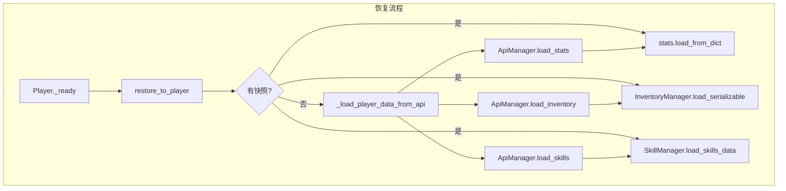
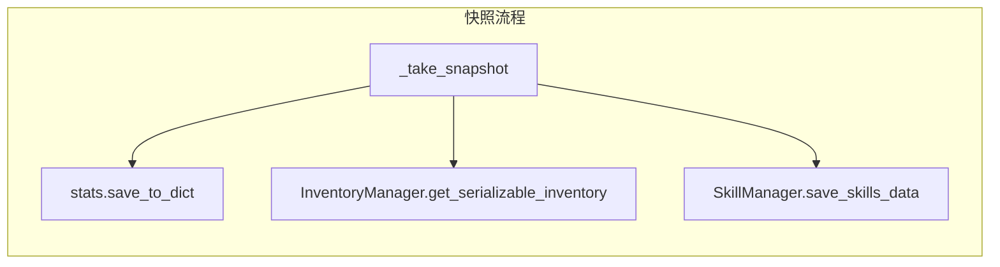
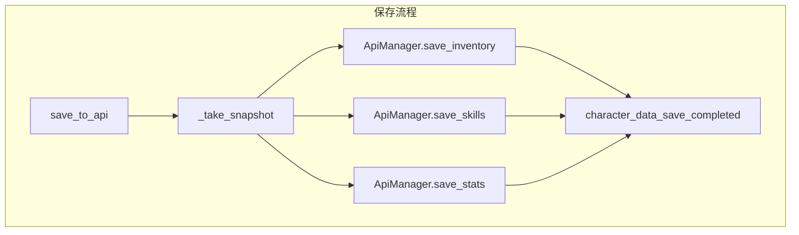

# CharacterDataManager 说明文档

CharacterDataManager 是**角色数据加载/保存**的全局统一入口，负责快照/恢复（减少场景切换时的 API 调用）和存档到 API。

**注意**：游戏存档（背包/技能/属性）由此模块负责，与 `SaveManager`（仅设置存档）不同。详见 `docs/SaveManager.md`。

---

## 一、概述

| 项 | 说明 |
|----|------|
| **脚本路径** | `autoload/CharacterDataManager.gd` |
| **Autoload 名称** | `CharacterDataManager` |
| **依赖** | UserManager、ApiManager、InventoryManager、SkillManager、GameDataManager |
| **基因** | GeneManager（Autoload），见 [GENE_SYSTEM.md](GENE_SYSTEM.md) |
| **客户端专属** | 第一/第三人称相机、`PlayerViewPaths`、场景节点层级**不**写入 stats API；持久化仍为属性、背包、技能、基因、`loadout`（武器槽）、`scene_path` / `position` / `rotation_y` 等（见 [PLAYER_CAMERA_AND_MOVEMENT.md](PLAYER_CAMERA_AND_MOVEMENT.md) §7） |

---

## 二、核心流程与数据流

### 2.1 恢复流程（restore_to_player）

```
Player._ready 末尾调用 CharacterDataManager.restore_to_player(self)
    ↓
若有快照：从内存恢复 Stats / Inventory / Skills
若无快照：从 API 并行请求并填充快照
    ↓
数据应用到 Player
```

### 2.2 快照流程（snapshot_before_scene_change）

```
场景切换前（portal / world / SceneManager）
    ↓
CharacterDataManager.snapshot_before_scene_change()
    ↓
快照 Stats / Inventory / Skills / Genes / 场景状态 到内存
```

### 2.3 保存流程（save_to_api）

```
触发保存（自动保存 / 退出主菜单 / 切换场景前）
    ↓
CharacterDataManager.save_to_api()
    ↓
先快照，再并行请求 API（10 秒冷却，force=true 可忽略）
    ↓
背包 / 技能 / 基因 各 1 次 POST；属性为 1 次 POST（stats.save_to_dict 含 experience、loadout，并可合并 scene_state）
    ↓
character_data_save_completed.emit()
```

### 2.4 数据流图







---

## 三、调用方式

### 3.1 Player 恢复数据

**Player._ready 末尾必须调用：**

```gdscript
CharacterDataManager.restore_to_player(self)
```

### 3.2 场景切换前快照

```gdscript
CharacterDataManager.snapshot_before_scene_change()
get_tree().change_scene_to_file("...")
```

SceneManager 已内置 snapshot_before_scene_change，通过 SceneManager.change_scene 的切换会自动快照。

### 3.3 保存角色数据

```gdscript
# 直接保存（受 10 秒冷却限制）
CharacterDataManager.save_to_api()

# 强制保存（登出等关键节点）
CharacterDataManager.save_to_api(Callable(), true)

# 带回调
CharacterDataManager.save_to_api(func(success, _resp): ...)
```

### 3.3 获取当前 Player

```gdscript
var player = CharacterDataManager.get_player()
# 通过 "Player" 组查找，返回 get_tree().get_first_node_in_group("Player")
```

---

## 四、已接入场景

| 场景 | 接入方式 |
|------|----------|
| world / terrain / tutorial / training_ground 等 | Player._ready 中 restore_to_player(self) |
| 场景切换 | portal、world、SceneManager 在切换前调用 snapshot_before_scene_change |

---

## 五、保存触发时机与保存内容

| 时机 | 调用位置 |
|------|----------|
| 自动保存（每 120 秒） | world.gd `_process` |
| 关闭暂停菜单（ESC） | PauseManager.close_pause_menu() |
| 退出到主菜单 | PauseManager.exit_to_main_menu()（**先完整保存再切场景**） |
| 切换场景前 | world.gd 交互切到 terrain；TutorialController 传送到 training_ground；portal 进入 world |

**保存内容**：角色属性（血量、攻防等）、武器槽位与弹药、背包、技能等级、基因、**场景状态**（场景路径、玩家位置与朝向）。

---

## 六、信号

| 信号 | 说明 |
|------|------|
| `character_data_loaded` | 从 API 加载完成 |
| `character_data_save_completed` | 保存完成 |
| `data_error` | 存档失败时发出（含原因字符串）；`CharacterDataManager` 内部已连接 **`GBMssage.show_message(..., "error")`** 与 `push_warning`，玩家可见 Toast |

---

## 七、前置条件

- **UserManager.current_character_id** 非空（登录后由 `list_characters` 或 `/me` 填充）
- **Player 节点** 需加入 `"Player"` 组
- **Player** 需有 `player_stats` 属性，且 Stats 实现 `load_from_dict` / `save_to_dict`

---

## 八、相关文档与测试

| 文档 | 说明 |
|------|------|
| [APIManager.md](APIManager.md) | API 接口说明 |
| [SaveManager.md](SaveManager.md) | 存档流程（含云端） |
| [GameDataManager.md](GameDataManager.md) | 静态数据加载 |
| [DAMAGE_SYSTEM.md](DAMAGE_SYSTEM.md) | 伤害与 Stats 流程 |
| [GENE_SYSTEM.md](GENE_SYSTEM.md) | 基因模块（待接入） |
| `test/api_test.gd` | 经 APIManager 覆盖主要 API，用于连通性、与后端契约及架构联调（见 `docs/TESTING.md`） |

---

## 九、新增场景接入步骤

1. 确保场景中有 Player 节点，且加入 `"Player"` 组
2. Player._ready 末尾调用 `CharacterDataManager.restore_to_player(self)`
3. 若需在离开场景前保存，在切换场景逻辑中调用 `CharacterDataManager.save_to_api()` 和 `snapshot_before_scene_change()`
