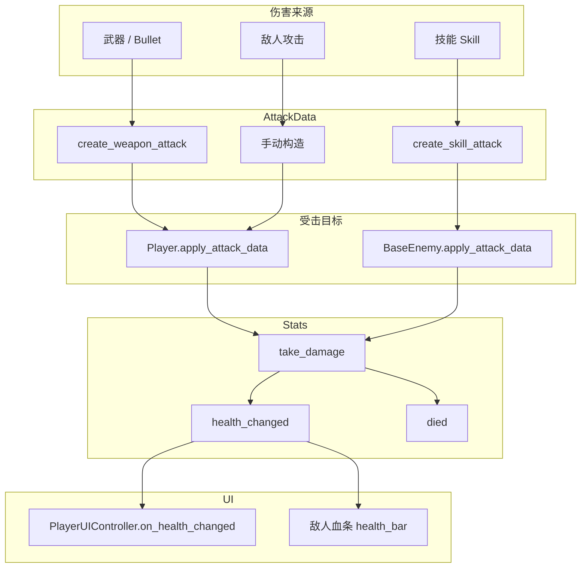
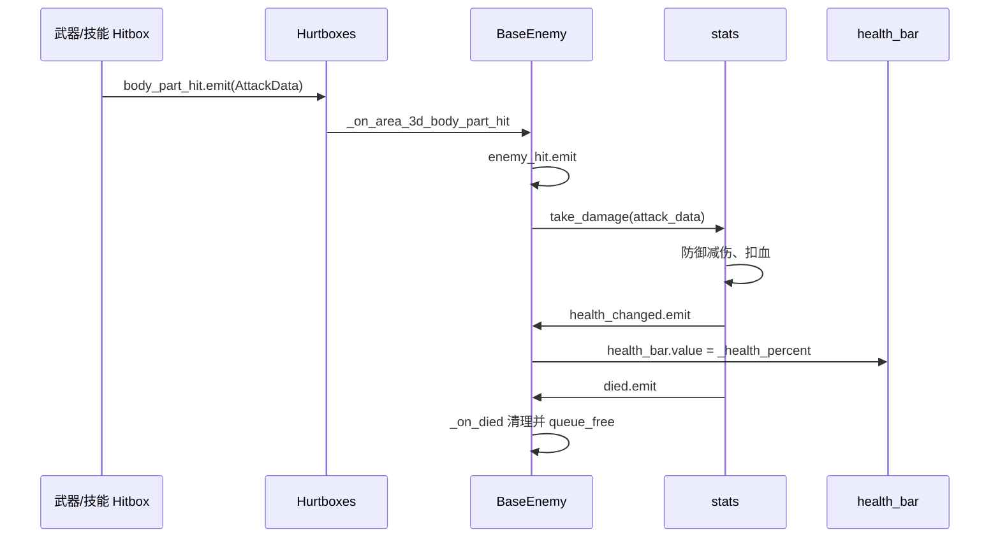

# 伤害系统说明文档

本文档描述项目中**伤害计算**、**受击流程**与 **Stats** 的架构，涵盖角色、敌人、技能、武器的统一伤害路径。

**文档分工**：敌人 AI、近战距离判定、起身无敌、生成贴地等 **不写在此**；见 **[ENEMY_SYSTEM.md](ENEMY_SYSTEM.md)**。

---

## 一、核心原则

- **Stats** 为血量与属性的唯一来源，所有伤害统一走 `Stats.take_damage(AttackData)`。
- **AttackData** 为伤害数据载体，包含 `base_damage`、`final_damage`、`body_part_multiplier`、`source`（WEAPON/SKILL）等。
- 受击后 `Stats.health_changed` 发出，UI 监听并更新血条；`Stats.died` 发出时触发死亡逻辑。

---

## 二、伤害数据流

---

## 三、角色受击流程

---

## 四、敌人受击流程

---

## 五、敌人攻击角色

数据链：**`EnemyMeleeFsm.on_hit_finished()`** → 构造 **`AttackData`**（`AttackType.WEAPON`，`source_node` 为敌人，`final_damage` 常用敌人 **`stats.current_attack`**）→ **`Player.apply_attack_data`** → **`player_stats.take_damage`** → `health_changed` / UI。

动画 **Method 轨**、**平面距离**、**`attack_range_slack`**、**AnimationPlayer `root_node`**、场景碰撞体与 **`NavigationAgent3D.radius`** 等实现细节集中在 **[ENEMY_SYSTEM.md](ENEMY_SYSTEM.md)**「敌人近战与命中判定」，此处不重复。

---

## 六、Stats.take_damage 计算逻辑

1. 使用 `AttackData.final_damage`（已含部位倍率）
2. 应用防御：`actual_damage = max(final_damage - current_defense, 0)`
3. 基因 **`damage_reduction_flat`**：再减去固定值（不低于 0）
4. 场景伤害（`HAZARD`）继续应用对应抗性
5. 扣血；若存在 **`on_hit_regen_pct_of_damage`**，按本次实际受伤再回复一部分（水螅基因近似）
6. 发出 `health_changed`；若生命 ≤ 0 则 `died`

---

## 七、基因与 outgoing 伤害（玩家 → 敌人）

- 玩家武器（`WeaponManager` / `Bullet`）在 `AttackData` 上设置 **`is_critical`**，经 `EnemyBodyPart` 计算 `final_damage` 后，由 **`BaseEnemy._apply_attacker_gene_modifiers`**：
  - 按目标 **`combat_tags`** 与基因 `vs_targets.tags` 交集，应用 `damage_multiplier` 与 `flat_damage`（`GeneManager.apply_outgoing_damage_vs_tags`）。
  - 若暴击，附加 **`crit_bonus_vs_current_hp_pct × 目标当前生命`**。
- 技能瞬发（`Skill._execute_instant_skill`）在命中前对敌人做相同修正。
- 详见 [GENE_SYSTEM.md](GENE_SYSTEM.md)。

---

## 八、AttackData 构造方式

| 来源 | 构造方法 |
|------|----------|
| 武器 | `AttackData.create_weapon_attack(weapon_data, attacker)` |
| 技能 | `AttackData.create_skill_attack(skill_resource, level, caster)` |
| 场景伤害 | `AttackData.create_hazard_attack(damage, hazard_node, hazard_type)` 或 `Hazard.create_attack_data(hazard_node)` |
| 敌人近战 | 手动 `AttackData.new()`，设置 `base_damage`、`final_damage`、`body_part_multiplier` |
| DOT/DEBUFF | 手动构造，`body_part_multiplier = 1.0` |

---

## 九、相关文件

| 文件 | 职责 |
|------|------|
| `resource/stats/stats.gd` | Stats 资源：take_damage、heal、recalculate_stats、health_changed、died |
| `resource/damageEvent/AttackData.gd` | 伤害数据：create_weapon_attack、create_skill_attack、create_hazard_attack、apply_body_part_multiplier |
| `resource/hazard/hazard.gd` | Hazard 资源：hazard_type(FIRE/POISON/THORNS/OTHER)、create_attack_data |
| `Script/poison_pool.gd` | 毒池场景伤害，必须注入 Hazard 资源（无则 push_warning） |
| `Script/player/Player.gd` | apply_attack_data、_on_stats_health_changed、health_changed 中继 |
| `Script/player/PlayerUIController.gd` | on_health_changed 更新血条 UI |
| `Script/enemy/BaseEnemy.gd` | 受击、起身无敌、DOT、`_on_died` 等（见 [ENEMY_SYSTEM.md](ENEMY_SYSTEM.md)） |
| `Script/enemy/enemy.gd` | `_hit_finished` → `EnemyMeleeFsm.on_hit_finished` |
| `Script/enemy/EnemyMeleeFsm.gd` | 近战状态与出手命中判定 |
