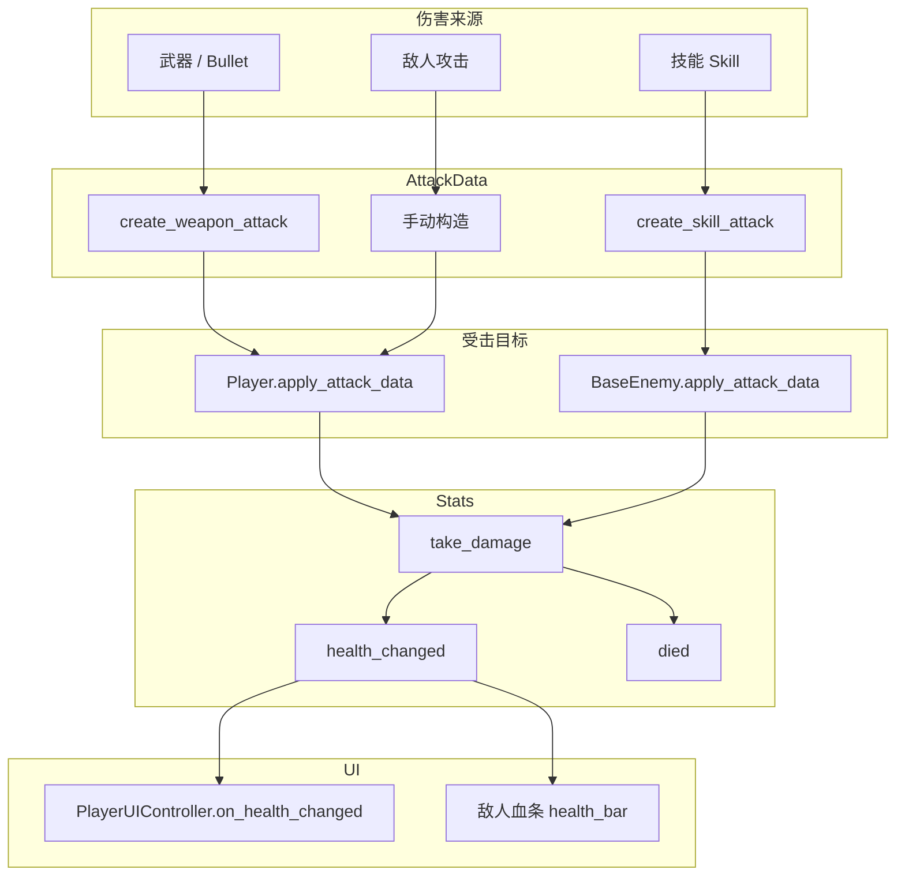
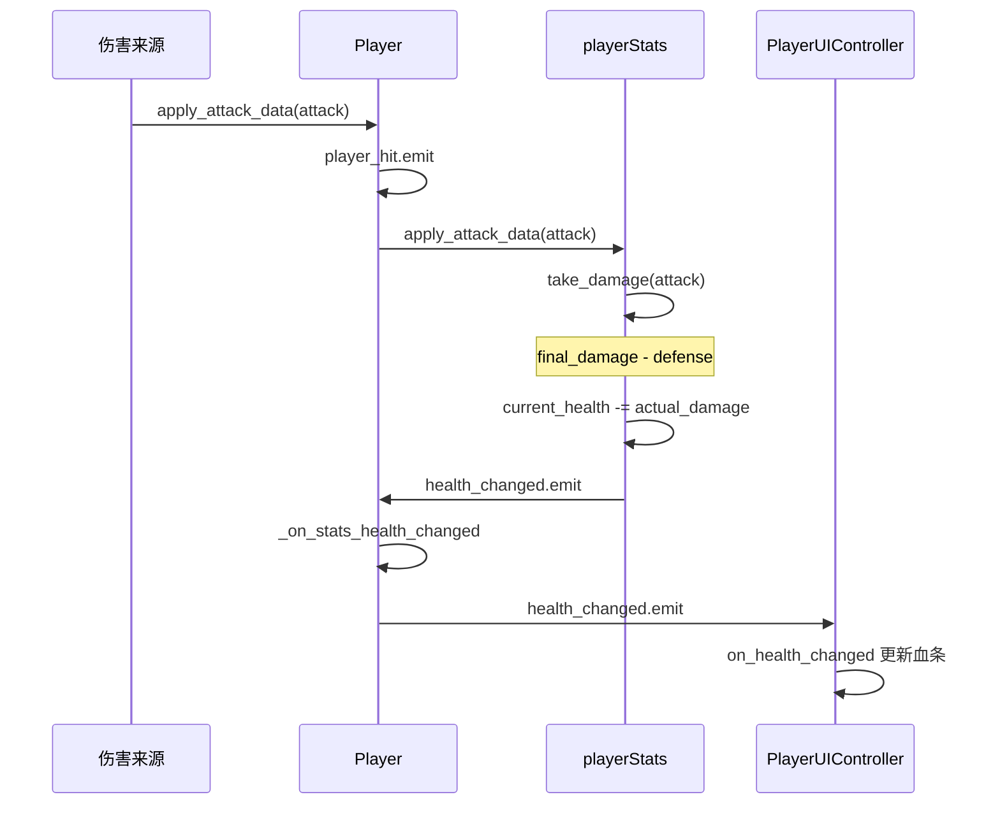
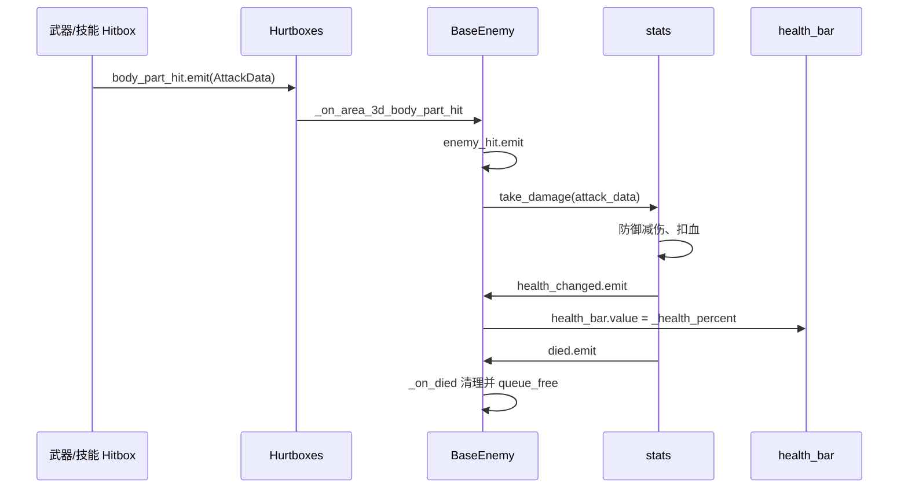
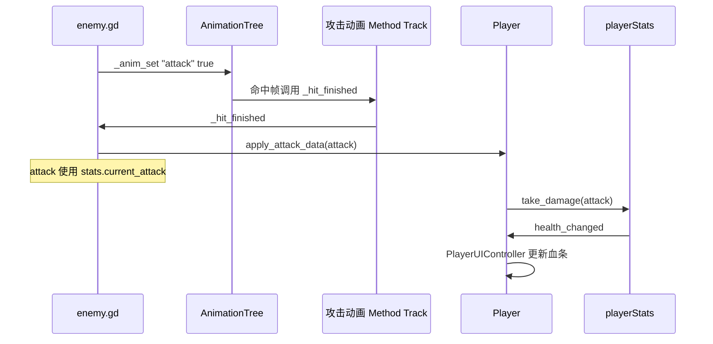

# 伤害系统说明文档

本文档描述项目中**伤害计算**、**受击流程**与 **Stats** 的架构，涵盖角色、敌人、技能、武器的统一伤害路径。

---

## 一、核心原则

- **Stats** 为血量与属性的唯一来源，所有伤害统一走 `Stats.take_damage(AttackData)`。
- **AttackData** 为伤害数据载体，包含 `base_damage`、`final_damage`、`body_part_multiplier`、`source`（WEAPON/SKILL）等。
- 受击后 `Stats.health_changed` 发出，UI 监听并更新血条；`Stats.died` 发出时触发死亡逻辑。

---

## 二、伤害数据流

---

## 三、角色受击流程

---

## 四、敌人受击流程

---

## 五、敌人攻击角色流程

---

## 六、Stats.take_damage 计算逻辑

1. 使用 `AttackData.final_damage`（已含部位倍率）
2. 应用防御：`actual_damage = max(final_damage - current_defense, 0)`
3. 扣血：`current_health = clamp(current_health - actual_damage, 0, current_max_health)`
4. 发出 `health_changed(current_health, current_max_health)`
5. 若 `current_health <= 0`，发出 `died`

---

## 七、AttackData 构造方式

| 来源 | 构造方法 |
|------|----------|
| 武器 | `AttackData.create_weapon_attack(weapon_data, attacker)` |
| 技能 | `AttackData.create_skill_attack(skill_resource, level, caster)` |
| 敌人近战 | 手动 `AttackData.new()`，设置 `base_damage`、`final_damage`、`body_part_multiplier` |
| DOT/DEBUFF | 手动构造，`body_part_multiplier = 1.0` |

---

## 八、相关文件

| 文件 | 职责 |
|------|------|
| `resource/stats/stats.gd` | Stats 资源：take_damage、heal、recalculate_stats、health_changed、died |
| `resource/damageEvent/AttackData.gd` | 伤害数据：create_weapon_attack、create_skill_attack、apply_body_part_multiplier |
| `Script/player/Player.gd` | apply_attack_data、_on_stats_health_changed、health_changed 中继 |
| `Script/player/PlayerUIController.gd` | on_health_changed 更新血条 UI |
| `Script/enemy/BaseEnemy.gd` | _on_area_3d_body_part_hit、_on_health_changed、_on_died |
| `Script/enemy/enemy.gd` | _hit_finished 构造 AttackData 并调用 Player.apply_attack_data |
