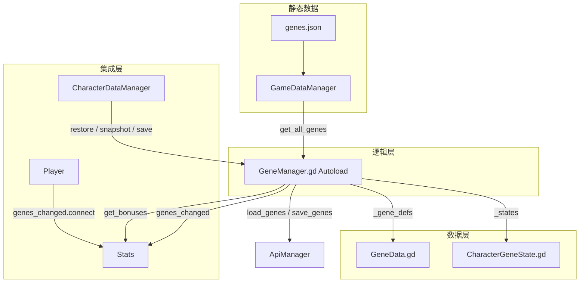
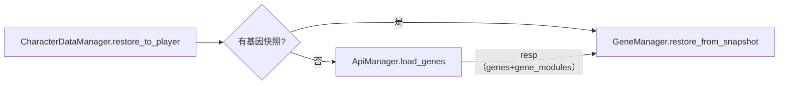
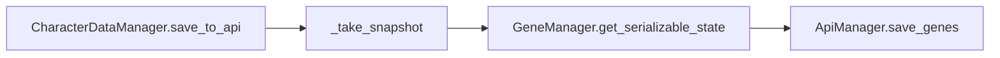
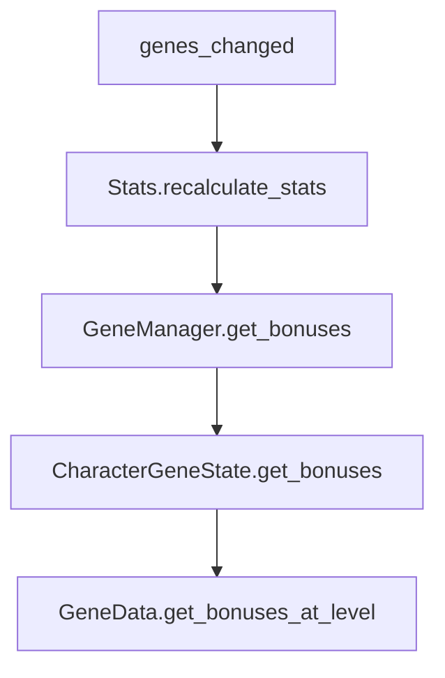

# 基因系统说明文档

本文档描述**基因模块**的架构、数据流与实现。基因系统已集成到项目中。

---

## 一、架构概述

- **GeneData**：基因定义模板（Resource），对标 ItemData，`from_dict()` 工厂，`get_bonuses_at_level()` 过滤元数据；可选 **`sub_gene_limits`**（总子基因数、按 `line_id` 上限）与后端 `game.genes.sub_gene_limits` 对齐。
- **CharacterGeneState**：角色基因运行时状态（Resource），对标 InventoryItem，脏标记缓存 `_cache_dirty`。
- **GeneManager**：Autoload 单例，基因定义缓存、状态管理、槽位/前置检查、属性加成汇总；**20 级前 `get_bonuses()` 视为无加成**；`apply_outgoing_damage_vs_tags` / `get_crit_bonus_damage_from_target_current_hp` 供战斗侧调用。
- **Stats**：`recalculate_stats()` 叠加基因；`process_effects` 驱动生命回复；`take_damage` 结算固定减伤与受击回复；`gain_experience` 吃经验加成；`get_skill_cooldown_multiplier()` 供技能 CD；四抗性使用 **`base_*_resistance` + 基因**，避免重复叠加。
- **Player**：`genes_changed.connect(recalculate_stats)`；`_physics_process` 调用 `player_stats.process_effects(delta)`；`CharacterDataManager.restore_to_player` 开头 `GeneManager.setup(UserManager.current_character_class)`。
- **BaseEnemy**：`combat_tags`、受击前 **`_apply_attacker_gene_modifiers`**（`vs_targets`、暴击生命百分比附加）；与 **`enemy_template_id`**、起身无敌、近战等并列运行时说明见 **[ENEMY_SYSTEM.md](ENEMY_SYSTEM.md)**。

---

## 二、核心文件

| 文件 | 职责 |
|------|------|
| `resource/gene/GeneData.gd` | 基因定义模板，含可选 `gene_modules[]`（`GeneModuleData`） |
| `resource/gene/GeneModuleData.gd` | 子基因模板：`line_id`、材料、基因点、`get_bonuses_at_level` |
| `resource/gene/CharacterGeneState.gd` | 主基因运行时状态，to_dict/from_dict |
| `resource/gene/CharacterGeneModuleState.gd` | 子基因运行时状态，to_dict/from_dict |
| `autoload/GeneManager.gd` | 核心管理器；主/子基因加成汇总；`*_via_api` 与后端扣点一致 |
| `resource/stats/stats.gd` | recalculate_stats 叠加基因加成 |
| `Script/player/Player.gd` | genes_changed 连接与断开 |
| `autoload/CharacterDataManager.gd` | 基因快照、恢复、保存 |

---

## 三、数据流

### 3.1 加载流程

### 3.2 保存流程

### 3.3 属性加成流程

---

## 四、API 与 CharacterDataManager

| 方法 | 说明 |
|------|------|
| `ApiManager.load_genes(character_id, callback)` | 加载角色基因（`genes` + `gene_modules`） |
| `ApiManager.save_genes(character_id, payload, callback)` | 保存：`{"genes":[]}` 可省略 `gene_modules`，服务端不覆盖子基因表 |
| `ApiManager.unlock_gene / upgrade_gene / toggle_gene` | 主基因操作（服务端扣基因点） |
| `ApiManager.unlock_gene_module / upgrade_gene_module` | 子基因操作（扣点 + 背包材料，成功后需同步背包） |
| `GeneManager.restore_from_snapshot(data)` | 从快照恢复（支持 `Array` 旧格式或 `{genes, gene_modules}`） |
| `GeneManager.get_serializable_state() -> Array` | 导出主基因快照 |
| `GeneManager.get_serializable_module_state() -> Array` | 导出子基因快照 |
| `GeneManager.unlock_gene_via_api / upgrade_gene_via_api` | 与后端扣点一致并刷新 `gene_points` |
| `GeneManager.unlock_gene_module_via_api / upgrade_gene_module_via_api` | 子基因服务端权威 + 自动 `refresh_inventory_from_api` |

---

## 五、GeneManager 操作接口

| 方法 | 说明 |
|------|------|
| `unlock_gene(gene_id) -> bool` | 本地解锁（扣本地基因点）；在线权威请用 `unlock_gene_via_api` |
| `upgrade_gene(gene_id) -> bool` | 本地升级；在线权威请用 `upgrade_gene_via_api` |
| `can_unlock_gene_module(module_id) -> String` | 子基因解锁预检（槽位/上限/材料/基因点），与后端规则一致 |
| `unlock_gene_module_via_api(module_id, callback)` | 子基因解锁（先 `can_unlock_gene_module`，再服务端扣点+材料，刷新背包） |
| `upgrade_gene_module_via_api(module_id, callback)` | 子基因升级 |
| `activate_gene(gene_id) -> bool` | 激活（占用槽位） |
| `deactivate_gene(gene_id) -> bool` | 停用 |
| `toggle_gene(gene_id) -> bool` | 切换激活状态 |
| `get_bonuses() -> Dictionary` | 所有激活基因的属性加成汇总 |
| `setup(char_class, initial_points=-1)` | 设置职业；`initial_points>=0` 时同步基因点 |
| `apply_outgoing_damage_vs_tags(base_damage, tags)` | 对带 `combat_tags` 的敌人叠乘/加 flat |
| `get_crit_bonus_damage_from_target_current_hp(hp)` | 暴击附加：目标当前生命 × 累计 `crit_bonus_vs_current_hp_pct` |
| `can_unlock(gene_id) -> String` | 检查是否可解锁，""=可 |
| `can_upgrade(gene_id) -> String` | 检查是否可升级 |

---

## 六、开放等级与基因点

| 规则 | 说明 |
|------|------|
| `GeneManager.GENE_SYSTEM_OPEN_LEVEL`（20） | 低于该等级：`get_bonuses()` 返回空加成；不可解锁/升级基因 |
| `GeneData.unlock_min_level` | 每条基因额外等级门槛（见 `genes.json`） |
| `gene_points` | 持久化在 **`game.character_stats.gene_points`**；`Stats.save_to_dict` / `load_from_dict` 与 `GeneManager` 同步；**主/子基因**通过 API 解锁与升级时由**服务端**扣除并与响应中的 `gene_points` 对齐 |
| `is_test` | `genes.json` 中 `is_test: true` 的条目 **不 seed**、**不入库**；`POST /characters/{id}/genes` 会过滤非法 ID；客户端 `get_serializable_state` 亦过滤 |
| 主基因消耗 | 与 `GeneManager.UNLOCK_COST` / `UPGRADE_COST_PER_LEVEL` 按**稀有度**一致（后端 `main.py` 常量同步） |
| 子基因 | 表 **`game.gene_modules`** / **`game.character_gene_modules`**；定义在 `genes.json` 的 **`modules[]`**；每条 module 有 **`line_id`**；主基因可选 **`sub_gene_limits`**：`max_modules_total`、`max_modules_per_line`（按线路键）；可配置 **`unlock_materials`**、**`upgrade_materials_per_level`** |
| 激活槽位 | `GeneManager.get_slot_limit()` = **职业上限** 与 **`GENE_ACTIVE_SLOT_HARD_MAX`（4）** 取小；与 FastAPI `save_character_genes` / `toggle_gene` 校验一致 |
| `POST .../genes/unlock` | 解锁后主基因 **`is_active=false`**（需再 toggle/存档激活），与 Godot 本地 `unlock_gene` 默认一致 |

---

## 七、genes.json v3（`level_effects` 数值键）

文件：`StarshipBackend/PSQL_DH/game_data/genes.json`，版本字段 `version: "3.0.0"`。

| 键 | 含义 | Stats / 战斗 |
|----|------|----------------|
| `attack_bonus` 等 | 平面加成 | `recalculate_stats` |
| `crit_rate` / `crit_rate_bonus` | 暴击率 | 合并入 `crit_rate_bonus` |
| `crit_damage_bonus` | 暴击伤害倍率加算 | `current_critical_damage` |
| `health_regen_per_sec` | 秒回 | `process_effects` → `heal` |
| `cooldown_reduction` | 冷却缩短比例（和上限 0.85） | `Skill.get_cooldown` |
| `fire_` / `poison_` / `thorns_` / `other_resistance_bonus` | 环境抗性 | `base_*_resistance` + 加成 |
| `damage_reduction_flat` | 每击固定减伤 | `take_damage` |
| `on_hit_regen_pct_of_damage` | 受击后按实际受伤回复 | `take_damage` |
| `experience_gain_bonus` / `gene_point_gain_bonus` | 经验 / 基因点倍率 | `gain_experience` / `add_gene_points` |
| `low_hp_*` | 低生命攻击/防御/全属性 | `recalculate_stats`（按当前生命比例） |
| `quantum_shared_stat_ratio` | 量子共振近似 | 暴击与闪避共享加成 |
| `vs_targets` | `[{ "tags":["MECHANICAL"], "damage_multiplier":1.12, "flat_damage":5 }]` | `BaseEnemy` 受击前对玩家攻击修正 |
| `crit_bonus_vs_current_hp_pct` | 暴击时附加目标当前生命比例 | 武器/技能暴击分支 |

**`combat_tags`**：场景可手写 **`BaseEnemy.combat_tags`**，或填 **`enemy_template_id`** 由 **`GameDataManager`** 从 `enemies.json` / API 同步；标签名须与 **`vs_targets.tags`** 一致（如 `MECHANICAL`、`CYBORG`）。敌人数据与受击全链路见 **[ENEMY_SYSTEM.md](ENEMY_SYSTEM.md)**；`enemies.json` 路径：`StarshipBackend/PSQL_DH/game_data/enemies.json`。

---

## 八、待实现 / 可选增强

| 项 | 说明 |
|----|------|
| 基因 UI | `character_menu.gd` 基因按钮仍为占位；需基因列表/解锁/升级/**子基因**面板；建议在线时使用 `*_via_api` |
| 全量存档 | 周期性 `save_genes` 仍同步状态；**子基因**字段缺省时后端不覆盖 `gene_modules` 表（兼容旧客户端） |
| `low_hp_immune_control` | 现为数据标记，硬直/眩晕免疫需状态机接入 |

---

## 九、数据库迁移

已有 PostgreSQL 库需依次（若尚未执行）：`MIGRATION_2026_GENE_MODULES.sql`（子基因表）、**`MIGRATION_2026_GENE_SLOTS_AND_LIMITS.sql`**（`genes.sub_gene_limits`、`gene_modules.line_id`），然后 `python seeder.py` 同步静态数据。
