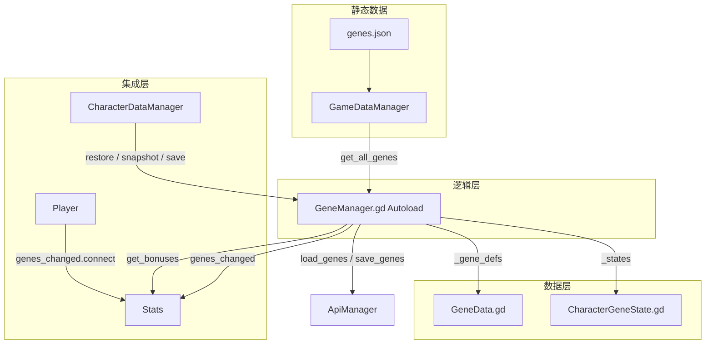
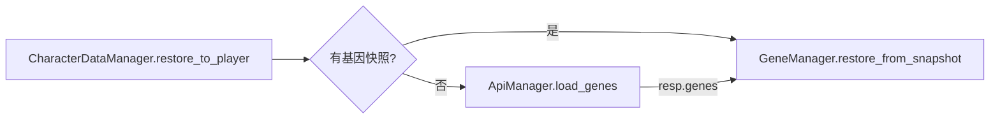
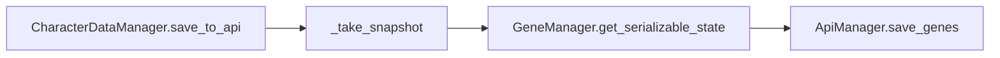
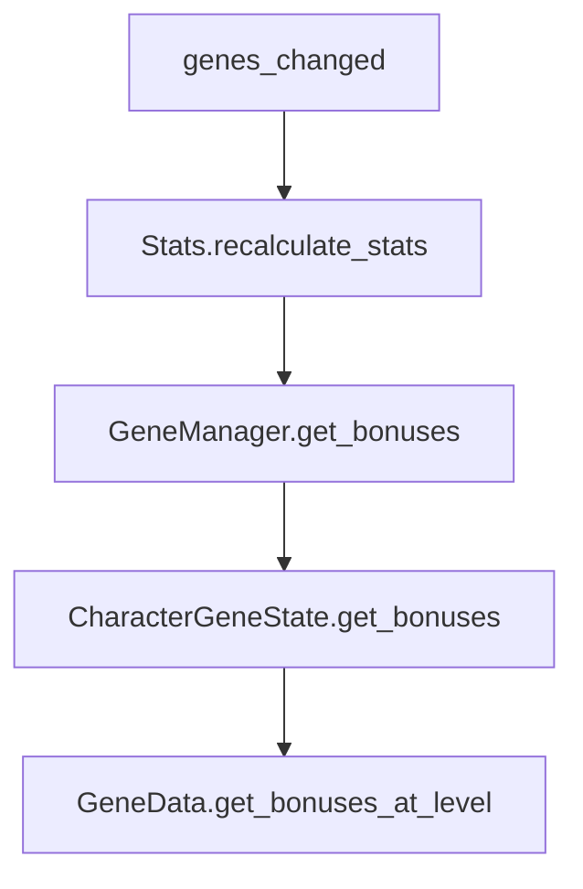

# 基因系统说明文档

本文档描述**基因模块**的架构、数据流与实现。基因系统已集成到项目中。

---

## 一、架构概述

- **GeneData**：基因定义模板（Resource），对标 ItemData，`from_dict()` 工厂，`get_bonuses_at_level()` 过滤元数据。
- **CharacterGeneState**：角色基因运行时状态（Resource），对标 InventoryItem，脏标记缓存 `_cache_dirty`。
- **GeneManager**：Autoload 单例，基因定义缓存、状态管理、槽位/前置检查、属性加成汇总。
- **Stats**：`recalculate_stats()` 内调用 `GeneManager.get_bonuses()` 叠加属性。
- **Player**：`_setup_player_stats()` 中 `GeneManager.genes_changed.connect(playerStats.recalculate_stats)`，场景切换时 `_notification(PREDELETE)` 断开连接。

---

## 二、核心文件

| 文件 | 职责 |
|------|------|
| `resource/gene/GeneData.gd` | 基因定义模板，from_dict、get_bonuses_at_level、get_rarity_color |
| `resource/gene/CharacterGeneState.gd` | 运行时状态，get_bonuses 懒加载缓存，to_dict/from_dict |
| `autoload/GeneManager.gd` | 核心管理器，unlock/upgrade/activate/deactivate/toggle，get_bonuses |
| `resource/stats/stats.gd` | recalculate_stats 叠加基因加成 |
| `Script/player/Player.gd` | genes_changed 连接与断开 |
| `autoload/CharacterDataManager.gd` | 基因快照、恢复、保存 |

---

## 三、数据流

### 3.1 加载流程

### 3.2 保存流程

### 3.3 属性加成流程

---

## 四、API 与 CharacterDataManager

| 方法 | 说明 |
|------|------|
| `ApiManager.load_genes(character_id, callback)` | 加载角色基因 |
| `ApiManager.save_genes(character_id, genes_list, callback)` | 全量保存 |
| `ApiManager.unlock_gene / upgrade_gene / toggle_gene` | 操作接口（与 GeneManager 本地逻辑配合） |
| `GeneManager.restore_from_snapshot(data: Array)` | 从快照恢复 |
| `GeneManager.get_serializable_state() -> Array` | 导出快照 |

---

## 五、GeneManager 操作接口

| 方法 | 说明 |
|------|------|
| `unlock_gene(gene_id) -> bool` | 解锁新基因 |
| `upgrade_gene(gene_id) -> bool` | 升级已解锁基因 |
| `activate_gene(gene_id) -> bool` | 激活（占用槽位） |
| `deactivate_gene(gene_id) -> bool` | 停用 |
| `toggle_gene(gene_id) -> bool` | 切换激活状态 |
| `get_bonuses() -> Dictionary` | 所有激活基因的属性加成汇总 |
| `setup(char_class, initial_points)` | 设置职业与基因点数 |
| `can_unlock(gene_id) -> String` | 检查是否可解锁，""=可 |
| `can_upgrade(gene_id) -> String` | 检查是否可升级 |

---

## 六、genes.json 与 Stats 字段映射

| genes.json level_effects | GeneManager.get_bonuses | Stats 叠加 |
|--------------------------|-------------------------|------------|
| `crit_rate` / `crit_rate_bonus` | `crit_rate_bonus` | `current_critical_rate` |
| `crit_damage_bonus` | `crit_damage_bonus` | `current_critical_damage` |
| `attack_bonus` | `attack_bonus` | `current_attack` |
| `defense_bonus` | `defense_bonus` | `current_defense` |
| `max_health_bonus` | `max_health_bonus` | `current_max_health` |
| `evasion_bonus` | `evasion_bonus` | `current_evasion` |

---

## 七、待实现

| 项 | 说明 |
|----|------|
| 基因 UI | 角色信息菜单中的基因面板（gene_panel、gene_card、gene_info_panel、gene_unlock_shop） |
| character_class 来源 | 从角色选择/API 获取职业，传入 GeneManager.setup |
| gene_points 来源 | 从等级/任务/API 获取，传入 GeneManager.setup 或 add_gene_points |
| API 操作同步 | unlock/upgrade/toggle 与后端 API 的实时同步（当前为本地 + 存档时全量保存） |
