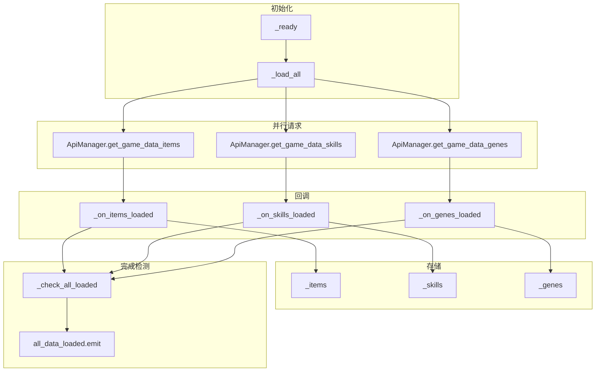

# GameDataManager 说明文档

GameDataManager 是**静态游戏数据**的全局加载与查询入口，在启动时从 API 拉取物品、技能、基因、**敌人模板**的定义数据，供全项目只读查询。

---

## 一、概述

| 项 | 说明 |
|----|------|
| **脚本路径** | `autoload/GameDataManager.gd` |
| **Autoload 名称** | `GameDataManager` |
| **依赖** | ApiManager |
| **数据来源** | `/game-data/items`、`/game-data/skills`、`/game-data/genes`、`/game-data/enemies`（无需 token） |

---

## 二、静态数据加载流程



---

## 三、加载状态

| 状态值 | 含义 |
|--------|------|
| 0 | 未开始 |
| 1 | 加载中 |
| 2 | 完成 |
| 3 | 失败 |

- **基因 / 敌人开关**：`_LOAD_GENES`、`_LOAD_ENEMIES` 为 `false` 时可关闭对应请求；默认二者均为 `true`，`required` 为 4。
- **信号**：`all_data_loaded`（全部完成）、`data_progress(loaded, total)`（进度）、`data_load_failed(reason)`（失败）。

---

## 四、公共查询 API

### 4.1 物品

| 方法 | 说明 |
|------|------|
| `get_item(item_id: int) -> Dictionary` | 按 item_id 获取定义，不存在返回 `{}` |
| `get_item_data(item_id: int) -> ItemData` | 构建或从 ItemDatabase 缓存获取 ItemData |
| `get_all_items() -> Array` | 所有物品定义 |
| `get_items_by_type(item_type: String) -> Array` | 按类型筛选 |
| `get_items_by_rarity(rarity: String) -> Array` | 按稀有度筛选 |

### 4.2 技能

| 方法 | 说明 |
|------|------|
| `get_skill(skill_id: int) -> Dictionary` | 按 skill_id 获取定义 |
| `get_skill_by_name(skill_name: String) -> Dictionary` | 按名称获取 |
| `get_skills_by_class(class_name: String) -> Array` | 按职业筛选 |
| `get_all_skills() -> Array` | 所有技能定义 |

### 4.3 基因

| 方法 | 说明 |
|------|------|
| `get_gene(gene_id: int) -> Dictionary` | 按 gene_id 获取定义 |
| `get_genes_by_type(gene_type: String) -> Array` | 按类型筛选（OFFENSIVE/DEFENSIVE/NEURAL 等） |
| `get_genes_available_for_class(class_name: String) -> Array` | 按职业筛选 |
| `get_all_genes() -> Array` | 所有基因定义 |
| `get_gene_level_effect(gene_id: int, level: int) -> Dictionary` | 某基因某等级的效果（level_effects 中匹配 level） |

### 4.4 敌人模板

| 方法 | 说明 |
|------|------|
| `get_enemy(enemy_id: int) -> Dictionary` | 含 `enemy_category`、`enemy_rank`、`combat_tags`、`behavior_tree_id`、`ai_behavior_packs`、`skills`、`drops`、`metadata`（`ai_profile` / `boss_phases` 等） |
| `get_enemy_combat_tags(enemy_id: int) -> Array[String]` | 大写标签，供 `BaseEnemy` 同步 |
| `get_all_enemies() -> Array` | 所有敌人定义 |

场景里在 **`BaseEnemy.enemy_template_id`** 填与 `enemies.json` 一致的 `enemy_id`，`_ready` 会用静态数据覆盖 `combat_tags`，与基因 `vs_targets.tags` 对齐。

---

## 五、使用示例

```gdscript
# 等待静态数据加载完成
if GameDataManager.is_loaded():
    _init_ui()
else:
    GameDataManager.all_data_loaded.connect(_init_ui, CONNECT_ONE_SHOT)

# 查询物品
var item = GameDataManager.get_item(1001)

# 查询技能
var skill = GameDataManager.get_skill_by_name("钛石冲击")

# 查询基因（需 _LOAD_GENES = true）
var gene = GameDataManager.get_gene(3001)
var effect = GameDataManager.get_gene_level_effect(3001, 2)

# 敌人 combat_tags（需 _LOAD_ENEMIES = true）
var tags = GameDataManager.get_enemy_combat_tags(4001003)
```

---

## 六、与 CharacterDataManager 的关系

`CharacterDataManager.load_and_apply()` 会等待 `GameDataManager.all_data_loaded` 后再从 API 加载角色运行时数据（背包、技能、属性）。静态数据与角色数据分离：GameDataManager 只负责定义，角色数据由各自的 Manager（InventoryManager、SkillManager 等）与 CharacterDataManager 负责。
