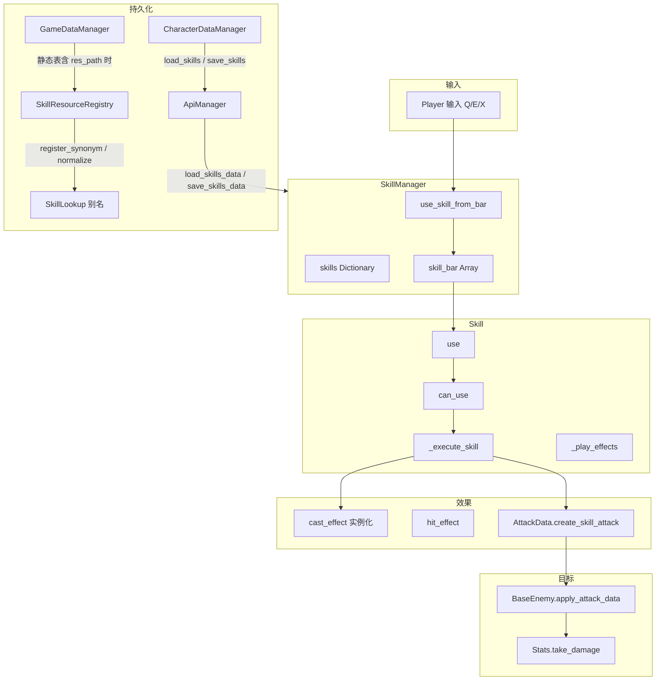

# 技能系统架构说明

本文档描述项目中技能的资源定义、管理器、执行流程与 UI 联动，便于扩展新技能或修改现有逻辑。

---

## 1. 模块职责与依赖关系

```
Player                      → SkillManager.character；默认技能栏见 PlayerDefaultSkillLoadout；输入 use_slot / use_skill_from_bar
SkillManager (autoload)     → skills 字典（键 = SkillResource.skill_name）+ skill_bar；add_skill / add_to_skill_bar / save/load
  └── Skill（多个）         → 单技能实例：冷却、等级、use() → _execute_skill() 按类型分发

SkillResource (.tres)       → 纯数据：skill_name（运行时字典键）、类型、曲线、cast_effect / 音效
SkillResourceRegistry       → autoload：game.skills.name（如中文）↔ SkillResource；供 load_skills_data / save 键转换
SkillLookup                 → 别名表：中文名、大小写、skill_id 字符串 → 规范 skill_name（见下文「技能名」）
GameDataManager             → 拉取 /game-data/skills 后写入 SkillResourceRegistry（含 metadata.res_path 时）

技能效果场景（如 fireball）  → 由 Skill 在 _execute_* 中 instantiate，setup(skill_resource, level, owner) + set_target(pos)
AttackData                  → create_skill_attack(...) 必须带有效 final_damage（见下文「技能伤害」）
```

- **解耦要点**：技能数值与成长在 **SkillResource**；施法逻辑在 **Skill** 内按 `skill_type` 分发；特效场景由资源引用，Skill 只做实例化与 `setup`/`set_target`。
- **SkillManager** 为 **autoload 单例**（`project.godot` 注册），`character` 在 Player._ready 中绑定当前 Player，用于效果节点的父节点与施法者。

### 1.1 技能系统数据流



对敌人的 **受击免疫（如起身）**、**`apply_attack_data` / `apply_dot`** 与模块划分见 **[ENEMY_SYSTEM.md](ENEMY_SYSTEM.md)**。

---

## 1.2 静态数据 JSON（`skills.json`）

| 项 | 说明 |
|----|------|
| **路径** | `StarshipBackend/PSQL_DH/game_data/skills.json` |
| **ID 方案** | `[30][分类2位][编号3位]`，如 `3002002 = PROJECTILE(02) + 第 002 号` |
| **字段** | `skill_id`、`name`、`description`、`skill_type`（INSTANT / PROJECTILE / AOE / DOT / BUFF / DEBUFF）、`max_level`、`cooldown`、`base_value`、`icon_path`、`metadata`（含 `scaling_per_level`、`damage_type` 等） |
| **`implemented`** | `true` = 已在 Godot 中有 `.tres` + 效果场景 + 脚本；缺省 = 仅设计稿 |
| **`res_path`** | 仅 `implemented=true` 时有效，指向 Godot 内 `SkillResource .tres` |
| **已实现技能** | 火球术 (`3002002`)、雷电术 (`3003008`)、群体治疗术 (`3005009`) |

---

## 2. 技能类型与执行流程

| 类型 | 枚举 | 执行入口 | 典型用法 |
|------|------|----------|----------|
| 瞬发 | INSTANT | `_execute_instant_skill` | 单目标直接伤害，AttackData + take_damage/apply_attack_data |
| 投射物 | PROJECTILE | `_execute_projectile_skill` | 实例化 cast_effect，setup(resource, level, owner)，set_target(pos) |
| 范围 | AOE | `_execute_aoe_skill` | 实例化 cast_effect 到目标位置，setup(..., duration)，由效果脚本内做范围 tick |
| 持续伤害 | DOT | `_execute_dot_skill` | 目标需有 apply_dot(damage, duration) |
| 增益 | BUFF | `_execute_buff_skill` | 实例化到目标位置或对目标 apply_buff，治疗/群体治疗等 |

执行顺序：`use()` → `can_use()`（非冷却）→ `_execute_skill()`（按 type 分支）→ `_play_effects()`（施法/命中特效与音效）→ `start_cooldown()` → `skill_used.emit(self)`。

---

## 3. 核心调用链

| 流程 | 调用链 |
|------|--------|
| 初始化 | Player `_ready` → `SkillManager.character = self` → `PlayerDefaultSkillLoadout`（`default_skill_loadout` 或 `create_test_loadout()`）→ `add_skill` + `add_to_skill_bar`；随后 `CharacterDataManager.restore_to_player` → `load_skills_data`（API 键为 `game.skills.name`） |
| 施法 | Player 输入（Skill1/2/3）→ `SkillManager.use_slot(slot, target_pos)` → `Skill.use` → `_execute_skill` → 实例化 cast_effect 并 setup/set_target |
| 冷却 | Skill `_process` 中 `cooldown_remaining -= delta`，归零时 `cooldown_finished.emit()` |
| 升级 | UI（如 skill_info_bg）→ `current_skill.level_up()` 或 `SkillManager.level_up_skill(skill_name)`（`skill_name` 可走别名，见第 10 节） |
| 伤害 | 效果脚本内 `AttackData.create_skill_attack(...)`（已同步 `final_damage`，见第 11 节）→ `apply_attack_data` / `enemy_hit` |

---

## 4. 技能资源（SkillResource）

- **路径**：`resource/skill/skillResource.gd`，.tres 示例：`GroupHealingSkill.tres`、`Fireball.tres`、`Lightning.tres`。
- **主要字段**：skill_name、description、icon、max_level；base_damage / base_cooldown / base_range / base_duration；成长曲线 damage_curve、cooldown_curve 等；skill_type（INSTANT/PROJECTILE/AOE/DOT/BUFF/DEBUFF）；cast_effect、hit_effect（PackedScene）；cast_sound、hit_sound。
- **方法**：get_damage(level)、get_cooldown(level)、get_range(level)、get_duration(level) 等，内部用 Curve 计算。

---

## 5. 技能效果脚本与场景

| 类型 | 脚本/场景 | 说明 |
|------|-----------|------|
| 火球 | `Script/SkillSystem/skill_fireball.gd`，`Scene/skill system/skill_effect/skill_fireball.tscn` | 投射物，setup + set_target，飞行中碰撞用 AttackData.create_skill_attack |
| 闪电 | `Script/SkillSystem/skill_lightning.gd`，`Scene/.../skill_lightning.tscn` | AOE/DOT，范围内周期 tick，对敌人 enemy_hit(attack) |
| 群体治疗 | `Script/SkillSystem/skill_group_healing.gd`，`Scene/.../skill_group_healing.tscn` | BUFF/治疗，Area 内周期 tick，apply_healing/apply_buff |

效果场景挂到 `owner_node.get_parent()` 或指定父节点，避免随 Player 移动时抖动；需实现 `setup(skill_resource, level, owner_node, ...)` 及按需 `set_target(position)`。

---

## 6. 技能 UI

| 文件 | 职责 |
|------|------|
| `Script/menu/skillSystem/skill_ui.gd` | 技能 UI 主控，收集技能按钮、展开/收起、与 SkillInfoBg 联动、setup_character |
| `Script/menu/skillSystem/skill_button.gd` | 技能按钮，linked_skill、setup_skill/clear_skill，点击发出 skill_button_clicked |
| `Script/menu/skillSystem/skill_info_bg.gd` | 技能详情面板，显示技能名/描述/属性/冷却，升级按钮调 current_skill.level_up |

UI 通过 SkillManager 的 `get_skill_bar_info()`、`get_all_skills_info()` 获取显示数据，与技能执行逻辑解耦。

---

## 7. 关键文件一览

| 文件 | 职责 |
|------|------|
| `autoload/SkillManager.gd` | 技能字典、技能栏、别名解析、旧键迁移、`save_skills_data` / `load_skills_data` |
| `autoload/SkillResourceRegistry.gd` | 中文 API 名 ↔ SkillResource；`_ready` 内置三条；`register_from_game_data_*` 对接静态表 |
| `Script/SkillSystem/skill_lookup.gd` | `SkillLookup`：规范 `skill_name`、同义词、`register_synonym` |
| `Script/player/player_default_skill_loadout.gd` | 默认测试技能栏条目与 `create_test_loadout()` |
| `Script/SkillSystem/Skill.gd` | 单技能：冷却、等级、use/can_use、_execute_skill 按类型分发、_play_effects |
| `resource/skill/skillResource.gd` | SkillResource 定义与曲线计算 |
| `resource/skill/*.tres` | 各技能资源配置（`skill_name` 须与 `SkillLookup` 常量及云端约定一致） |
| `resource/damageEvent/AttackData.gd` | `create_skill_attack`（`base_damage` + `final_damage`） |
| `Script/SkillSystem/skill_fireball.gd` | 火球投射物逻辑 |
| `Script/SkillSystem/skill_lightning.gd` | 闪电范围/持续伤害 |
| `Script/SkillSystem/skill_group_healing.gd` | 群体治疗 |
| `autoload/GameDataManager.gd` | 静态技能表加载后 `_register_skills_in_resource_registry()` |

---

## 8. 扩展新技能

1. **资源**：复制现有 .tres，设置稳定的 **`skill_name`**（`SkillManager.skills` 字典键）、`skill_type`、曲线与 `cast_effect` / 音效。
2. **效果场景**（若为新类型）：新建场景，根脚本实现 `setup(skill_resource, level, owner_node, ...)` 与碰撞/范围逻辑；伤害用 **`AttackData.create_skill_attack`**（勿手写 `final_damage=0`）。
3. **注册到运行时**：在 **`SkillResourceRegistry._ready`**（或启动时逻辑）中 `_register_skill("数据库中的 name", 新 SkillResource)`；若仅有静态 JSON，确保 **`skills.json` 的 `res_path`** 经 seeder 写入 `extra_data`，由 **`GameDataManager`** 拉表后自动 `register_mapping`。
4. **别名（可选）**：对易混拼写、旧存档键、**`skill_id` 字符串**，调用 **`SkillLookup.register_synonym("别名", "规范 skill_name")`**。
5. **Player 上栏**：`add_skill` 后 `add_to_skill_bar`（参数可为 **`skill_resource.skill_name`** 或 **`game.skills.name`** 中文名，二者经解析等价）。
6. **输入**：`InputController` 的 Skill1/2/3 → `Player._on_skill_slot_pressed` → `SkillManager.use_slot`；以自身为中心的技能在 **`PlayerDefaultSkillBarEntry.use_caster_position_as_target`** 配置。

---

## 9. 与教程系统

技能输入（如 Skill1/Skill2/Skill3）受 **TutorialManager** 的 `is_action_allowed()` 控制；教程步骤 SKILL 阶段才允许释放技能，此前可禁用对应 action 或在校验中调用 TutorialManager。

---

## 10. 技能名：`SkillLookup` 与 `SkillResourceRegistry`

| 概念 | 说明 |
|------|------|
| **运行时键** | `SkillResource.skill_name`，存入 **`SkillManager.skills`**。当前三条示例：`FireBall`、`Lightning`、**`group healing`**（群体治疗）。 |
| **云端 / 存档键** | 通常为 **`game.skills.name`**（如 `火球术`、`群体治疗术`）。`save_skills_data` / `load_skills_data` 经 **`SkillResourceRegistry.runtime_name_to_api_key` / `get_resource_for_api_key`** 转换。 |
| **`SkillLookup`** | **`normalize_lookup_key`**：把中文名、大小写变体、`skill_id` 字符串等映射到上述运行时键；**`register_synonym`** 供新技能或热修补登记。 |
| **`SkillResourceRegistry`** | **`_ready`** 中预注册三条内置技能；**`register_from_game_data_skill_list`** 在 **`GameDataManager`** 从 API 或本地缓存加载静态表后调用，使带 **`metadata.res_path`** 的行可自动 `load` 并 `register_mapping`。 |

调试 **`add_to_skill_bar` 失败**时，查看控制台 **`push_warning`**：含 **`SkillLookup.format_lookup_attempt`** 与当前已学会的键列表。

---

## 11. 技能伤害与 `AttackData.create_skill_attack`

**`Stats.take_damage(attack_data)` 只读取 `attack_data.final_damage`**，不自动回退到 `base_damage`。

- **`create_skill_attack`** 在设置 **`base_damage`** 后，会同步 **`final_damage = base_damage`**，保证投射物、AOE tick、不经 **`EnemyBodyPart.apply_body_part_multiplier`** 的路径仍能造成伤害。
- **`Skill.gd` 中 INSTANT** 等分支若已自行改写 **`final_damage`**（暴击、基因等），保持在该分支内赋值即可。
- 命中 **`EnemyBodyPart`** 时，**`apply_body_part_multiplier`** 对 **`AttackType.SKILL`** 仍将 **`final_damage`** 设为 **`base_damage`**（与部位倍率注释一致）。

---

## 12. 静态数据与数据库（`skills.json` / seeder）

- **`skills.json`** 顶层 **`res_path`、`implemented`** 在 **`StarshipBackend/PSQL_DH/seeder.py`** 中与 **`metadata`** 一并写入 **`game.skills.extra_data`**，便于 **`/game-data/skills`** 把 **`res_path`** 下发给客户端。
- 客户端 **`GameDataManager`** 在技能数组就绪或从加密缓存恢复后，调用 **`SkillResourceRegistry.register_from_game_data_skill_list`**，用 **`metadata.res_path`** 加载 **`SkillResource`** 并登记 **`name` / `skill_id`** 同义词。

更完整的角色存档管线见 **[CharacterDataManager.md](CharacterDataManager.md)** 及 **`autoload/APIManager.gd`** 中 `load_skills` / `save_skills` 注释。
