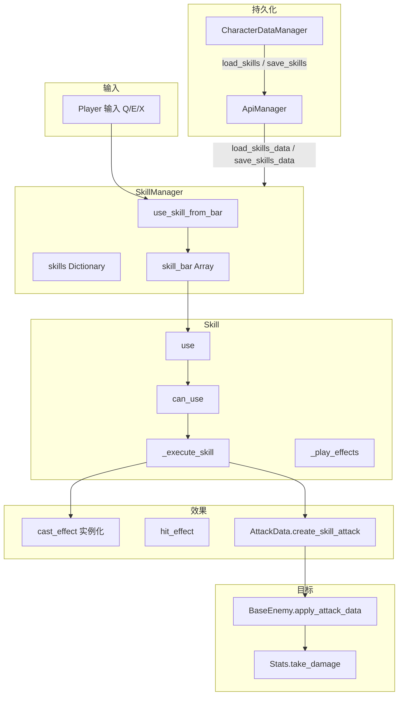

# 技能系统架构说明

本文档描述项目中技能的资源定义、管理器、执行流程与 UI 联动，便于扩展新技能或修改现有逻辑。

---

## 1. 模块职责与依赖关系

```
Player                      → 输入调用 use_skill_from_bar(slot, target_pos)；_ready 中 SkillManager.character = self
SkillManager (autoload)     → 技能字典 + 技能栏槽位；add_skill / add_to_skill_bar / use_skill_from_bar / level_up_skill
  └── Skill（多个）         → 单技能实例：冷却、等级、use() → _execute_skill() 按类型分发

SkillResource (.tres)       → 纯数据：名称、类型、曲线(伤害/冷却/范围/持续)、cast_effect / hit_effect / 音效
技能效果场景（如 fireball）  → 由 Skill 在 _execute_* 中 instantiate，setup(skill_resource, level, owner) + set_target(pos)
AttackData                  → create_skill_attack(skill_resource, level, caster) 供技能伤害与敌人受击
```

- **解耦要点**：技能数值与成长在 **SkillResource**；施法逻辑在 **Skill** 内按 `skill_type` 分发；特效场景由资源引用，Skill 只做实例化与 `setup`/`set_target`。
- **SkillManager** 为 **autoload 单例**（`project.godot` 注册），`character` 在 Player._ready 中绑定当前 Player，用于效果节点的父节点与施法者。

### 1.1 技能系统数据流



---

## 2. 技能类型与执行流程

| 类型 | 枚举 | 执行入口 | 典型用法 |
|------|------|----------|----------|
| 瞬发 | INSTANT | `_execute_instant_skill` | 单目标直接伤害，AttackData + take_damage/apply_attack_data |
| 投射物 | PROJECTILE | `_execute_projectile_skill` | 实例化 cast_effect，setup(resource, level, owner)，set_target(pos) |
| 范围 | AOE | `_execute_aoe_skill` | 实例化 cast_effect 到目标位置，setup(..., duration)，由效果脚本内做范围 tick |
| 持续伤害 | DOT | `_execute_dot_skill` | 目标需有 apply_dot(damage, duration) |
| 增益 | BUFF | `_execute_buff_skill` | 实例化到目标位置或对目标 apply_buff，治疗/群体治疗等 |

执行顺序：`use()` → `can_use()`（非冷却）→ `_execute_skill()`（按 type 分支）→ `_play_effects()`（施法/命中特效与音效）→ `start_cooldown()` → `skill_used.emit(self)`。

---

## 3. 核心调用链

| 流程 | 调用链 |
|------|--------|
| 初始化 | Player `_ready` → `skill_manager.character = self`，`add_skill(SkillResource, level)`，`add_to_skill_bar(skill_name, slot_index)` |
| 施法 | Player 输入（如 Q/E/X）→ `skill_manager.use_skill_from_bar(slot_index, get_target_position())` → 对应 `Skill.use(target_position)` → `_execute_skill` → 实例化 cast_effect 并 setup/set_target |
| 冷却 | Skill `_process` 中 `cooldown_remaining -= delta`，归零时 `cooldown_finished.emit()` |
| 升级 | UI（如 skill_info_bg）→ `current_skill.level_up()` 或 `skill_manager.level_up_skill(skill_name)` |
| 伤害 | 技能效果脚本内用 `AttackData.create_skill_attack(skill_resource, level, caster)`，再调用敌人 `enemy_hit(attack)` 或 Stats.take_damage |

---

## 4. 技能资源（SkillResource）

- **路径**：`resource/skill/skillResource.gd`，.tres 示例：`GroupHealingSkill.tres`、`Fireball.tres`、`Lightning.tres`。
- **主要字段**：skill_name、description、icon、max_level；base_damage / base_cooldown / base_range / base_duration；成长曲线 damage_curve、cooldown_curve 等；skill_type（INSTANT/PROJECTILE/AOE/DOT/BUFF/DEBUFF）；cast_effect、hit_effect（PackedScene）；cast_sound、hit_sound。
- **方法**：get_damage(level)、get_cooldown(level)、get_range(level)、get_duration(level) 等，内部用 Curve 计算。

---

## 5. 技能效果脚本与场景

| 类型 | 脚本/场景 | 说明 |
|------|-----------|------|
| 火球 | `Script/SkillSystem/skill_fireball.gd`，`Scene/skill system/skill_effect/skill_fireball.tscn` | 投射物，setup + set_target，飞行中碰撞用 AttackData.create_skill_attack |
| 闪电 | `Script/SkillSystem/skill_lightning.gd`，`Scene/.../skill_lightning.tscn` | AOE/DOT，范围内周期 tick，对敌人 enemy_hit(attack) |
| 群体治疗 | `Script/SkillSystem/skill_group_healing.gd`，`Scene/.../skill_group_healing.tscn` | BUFF/治疗，Area 内周期 tick，apply_healing/apply_buff |

效果场景挂到 `owner_node.get_parent()` 或指定父节点，避免随 Player 移动时抖动；需实现 `setup(skill_resource, level, owner_node, ...)` 及按需 `set_target(position)`。

---

## 6. 技能 UI

| 文件 | 职责 |
|------|------|
| `Script/menu/skillSystem/skill_ui.gd` | 技能 UI 主控，收集技能按钮、展开/收起、与 SkillInfoBg 联动、setup_character |
| `Script/menu/skillSystem/skill_button.gd` | 技能按钮，linked_skill、setup_skill/clear_skill，点击发出 skill_button_clicked |
| `Script/menu/skillSystem/skill_info_bg.gd` | 技能详情面板，显示技能名/描述/属性/冷却，升级按钮调 current_skill.level_up |

UI 通过 SkillManager 的 `get_skill_bar_info()`、`get_all_skills_info()` 获取显示数据，与技能执行逻辑解耦。

---

## 7. 关键文件一览

| 文件 | 职责 |
|------|------|
| `autoload/SkillManager.gd` | 技能字典、技能栏、add_skill/add_to_skill_bar、use_skill/use_skill_from_bar、level_up_skill、save/load |
| `Script/SkillSystem/Skill.gd` | 单技能：冷却、等级、use/can_use、_execute_skill 按类型分发、_play_effects |
| `resource/skill/skillResource.gd` | SkillResource 定义与曲线计算 |
| `resource/skill/*.tres` | 各技能资源配置 |
| `resource/damageEvent/AttackData.gd` | create_skill_attack(skill_resource, level, caster) |
| `Script/SkillSystem/skill_fireball.gd` | 火球投射物逻辑 |
| `Script/SkillSystem/skill_lightning.gd` | 闪电范围/持续伤害 |
| `Script/SkillSystem/skill_group_healing.gd` | 群体治疗 |

---

## 8. 扩展新技能

1. **资源**：复制现有 .tres（如 Fireball.tres），改 skill_name、skill_type、曲线与 cast_effect/hit_effect。
2. **效果场景**（若为新类型）：新建场景，根脚本实现 `setup(skill_resource, level, owner_node, ...)` 与碰撞/范围逻辑，内部用 `AttackData.create_skill_attack` 或 apply_healing 等。
3. **注册**：在 Player（或关卡）`_ready` 中 `skill_manager.add_skill(新 SkillResource, 1)`，`add_to_skill_bar("新技能名", slot_index)`。
4. **输入**：在 Player 的 skill 输入分支中为对应槽位调用 `use_skill_from_bar(slot_index, get_target_position())`（或 get_player_position() 用于以自身为中心的范围技能）。

---

## 9. 与教程系统

技能输入（如 Skill1/Skill2/Skill3）受 **TutorialManager** 的 `is_action_allowed()` 控制；教程步骤 SKILL 阶段才允许释放技能，此前可禁用对应 action 或在校验中调用 TutorialManager。
