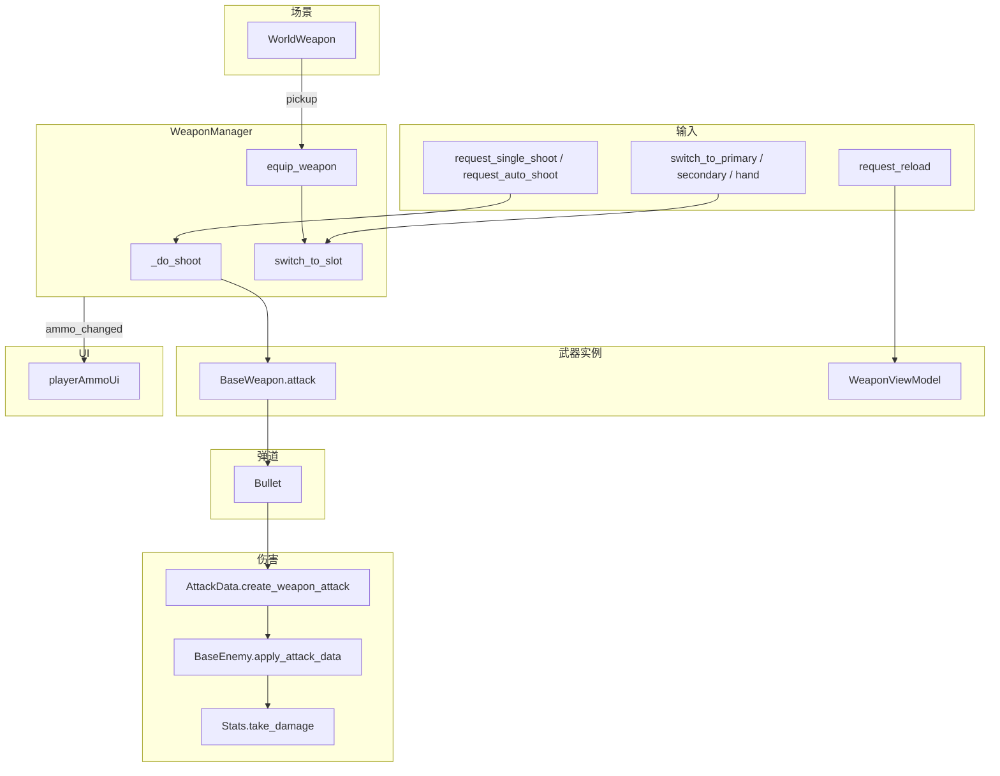

# 武器系统架构说明

本文档描述项目中武器调用机制、解耦设计、音效与可维护性要点。

## 武器系统数据流



- 敌人侧 **Hurtboxes / bodypart → BaseEnemy → Stats** 与起身无敌等见 **[ENEMY_SYSTEM.md](ENEMY_SYSTEM.md)**；上图中 **Enemy** 表示命中后进入敌人伤害管线的概括。

## 0. 静态数据 JSON（`weapons.json`）

| 项 | 说明 |
|----|------|
| **路径** | `StarshipBackend/PSQL_DH/game_data/weapons.json` |
| **ID 方案** | `[40][分类2位][编号3位]`，如 `4001001 = 手枪(01) + 第 001 号` |
| **分类** | `01`=手枪, `02`=冲锋枪, `03`=突击步枪, `04`=霰弹枪, `05`=狙击步枪, `06`=重武器 |
| **字段** | `weapon_id`、`name`、`description`、`weapon_type`（PISTOL / SMG / RIFLE …）、`weapon_slot`（PRIMARY / SECONDARY）、`rarity`、`element`（PHYSICAL / LASER / DARK_MATTER / BIOLOGY）、`max_level`、`**icon_path**`（`res://` 纹理，入库 `game.weapons.icon_path`，与客户端 `WeaponData.wheel_icon` 对齐）、`stats`（含 `base_damage`、`crit_rate`、`crit_multiplier`、`fire_rate`、`reload_time`、`magazine`、`max_reserve_ammo`、`auto_fire`）、`metadata` |
| **`implemented`** | `true` = 已在 Godot 中有 `WeaponData .tres` + 场景 |
| **已实现武器** | PISTOL (`4001001`)、MP7 (`4002001`) |
| **后端** | `GameWeapon` model → `/game-data/weapons` API → `GameDataManager.get_weapon()` |

### 武器 HUD（WeaponWheel）槽位约定

- **常驻显示**：`UI/WeaponWheel` 为右下角 **常驻** 三槽 HUD（`WeaponWheel.gd`），**不再**使用 Tab 展开式轮盘；武器切换仍由 `change_weapon1/2`、`change_hand`、滚轮等输入驱动 `WeaponManager`。
- **UI 子节点**：`WeaponWheel` 下固定三个 `WeaponWheelSlot`：**Weapon1** = 徒手（刀图标）、**Weapon2** = 副武器槽、**Weapon3** = 主武器槽（与 `WeaponManager` 的 `SLOT_HAND` / `SLOT_SECONDARY` / `SLOT_PRIMARY` 一一对应）。
- **图标来源优先级**（`Player._resolve_weapon_wheel_icon`）：`WeaponData.wheel_icon`（`.tres`）→ `GameDataManager` 静态表 `icon_path`（`weapons.json` / DB）→ 按 `Weapon_name` 的本地 fallback。
- **空槽占位**：无武器时 Weapon2/3 显示 `—` 与 `wheel_slot_empty.png`（或回退 `bullet_icon.png`）。

---

## 1. 模块职责与依赖关系

```
Player                    → 只调用 WeaponManager API + 连接信号，不持有武器/子弹节点
  └── Weapon_manager      → 唯一武器入口：装备/切换/射击/换弹，持有槽位与 viewmodel
		├── BaseWeapon    → 射速冷却 + 子弹生成（由 Manager 调用 attack(muzzle, target)）
		└── SubViewport   → 内嵌 WeaponViewModel（动画、晃动、muzzle 位置）

WorldWeapon（场景可拾取）  → 持有 data + weapon_scene + viewmodel_scene；pickup(weapon_manager) 时传入
Bullet                    → 仅由 BaseWeapon._fire_projectile() 实例化，不直接被 Player/Manager 引用
WeaponData (.tres)        → 纯数据，不引用任何 .tscn；可选 audio_data: WeaponAudioData
AttackData                → 由 WeaponManager 或 Bullet 构造，交给敌人 enemy_hit(attack)
AudioManager（autoload）   → 武器音效入口：play_weapon_shoot / play_dry_fire / play_reload / play_equip
```

- **解耦要点**：场景引用（weapon_scene / viewmodel_scene）放在 **WorldWeapon** 上，不放在 WeaponData 中，避免 .tres → .tscn 循环依赖。
- **Player** 与武器逻辑解耦：仅通过 `weapon_manager.request_*` / `switch_to_*` / `apply_sway` 等 API 与 `ammo_changed` 等信号交互；**不再**向 `WeaponManager.setup()` 传入相机/射线（已移除），由 WeaponManager 在 `_ready` 自发现节点。
- **WeaponManager 节点绑定（自发现）**：
  - 挂在 **CharacterBody3D 根下**（如 `Weapon_manager`）；在 `_ready` 中解析 `FPCamera`（默认路径 `firstperson/nek/head/CameraRigFP/FPCamera`）用于 viewmodel 与 `is_current()` 判断。仍兼容旧版「挂在 FPCamera 下」。
  - 沿父链向上找到 `CharacterBody3D` 作为玩家根；`world_root = player.get_parent()`（子弹父节点）。
  - 第一人称瞄准：默认取 **FPCamera**（`CameraRigFP.tscn` 内唯一名）下子节点 `Aimray`、`aimrayend`。
  - 第三人称瞄准：默认取玩家根下 `thirdperson/Yaw/Pitch/SpringArm3D/Camera3D/Aimray` 与 `aimrayend`（常量集中定义在 `Script/player/player_view_paths.gd` 的 `PlayerViewPaths`）。
  - 若层级不同，在检视器 `Weapon_manager` 上设置 **weapon_bind_***（`weapon_bind_fp_*` 为相对 WeaponManager 的 `NodePath`，`weapon_bind_tp_*` 为相对玩家 `CharacterBody3D` 的 `NodePath`）。
  - **禁止**将 `WeaponManager.gd` 加入 `project.godot` 的 autoload：autoload 父节点为根窗口，无法解析玩家与 FPCamera。
- **其它可选架构**（未实现）：用 `SceneUniqueName`（`%Aimray`）或 **Groups**（如 `weapon_aim_fp`）在运行时 `get_tree().get_nodes_in_group`；多人时需每组仅一个节点或改为从玩家子树内搜索，避免串台。
- **音效解耦**：WeaponData 可选 `audio_data: WeaponAudioData`；无该字段的武器不播声，WeaponManager 内 `_play_*` 做空判断后调 AudioManager。

## 2. 核心调用链

| 流程     | 调用链 |
|----------|--------|
| 捡枪     | Player 射线检测 "weapon_pickup" → `WorldWeapon.pickup(weapon_manager)` → `equip_weapon(data.duplicate(), weapon_scene, viewmodel_scene)` → `switch_to_slot(slot)`；若有 audio_data 播装备音 |
| 射击     | Player 输入 → `request_single_shoot()` / `request_auto_shoot()` → `_do_shoot()` → 射线取目标 → `BaseWeapon.attack(muzzle, target)` → 若有 audio_data 播射击音 → `_fire_projectile()` 实例化 Bullet |
| 空仓     | 弹匣空时按射击 → `_play_dry_fire()`（一次按下只播一次，松开重置）→ `request_reload()` |
| 换弹     | Player 输入 → `request_reload()` → 若有 audio_data 播换弹音 → viewmodel `play_reload()` → 等待 → `data.do_reload()` → `ammo_changed.emit()` |
| 切枪     | `switch_to_primary/secondary/hand()` 或滚轮 `next_weapon`/`prev_weapon` → `switch_to_slot()` / `switch_to_next()` / `switch_to_prev()`；切到武器时若有 audio_data 播装备音 |
| 丢弃武器 | Player 输入 `drop(G)` → `WeaponManager.request_drop_current_weapon()` → 沿 **当前主相机视线**（≈鼠标瞄准方向）生成 `WorldWeapon`（世界展示模型由 `WorldWeapon.create_runtime_pickup` 实例化并去碰撞/禁用逻辑帧）→ 清空槽位并切回徒手；丢弃物使用 `WeaponData.duplicate(false)` 保留弹药等字段并避免深拷贝大资源带来的卡顿 |
| 弹药 UI  | `WeaponManager.ammo_changed` → Player `_on_ammo_changed` → `Update_Ammo.emit()` → playerAmmoUi 更新文本 |

## 3. 槽位与滚轮切换

- **槽位**：`SLOT_HAND(-1)` / `SLOT_PRIMARY(0)` / `SLOT_SECONDARY(1)`。
- **滚轮**：输入 `next_weapon` / `prev_weapon` 映射到 `switch_to_next()` / `switch_to_prev()`，按顺序循环：primary → secondary → hand → primary；空槽自动跳过。
- **丢弃**：输入 `drop`（默认 G）仅对当前持枪槽生效（徒手不可丢）；丢弃物会携带当前弹药并可再次拾取。

## 4. 音效与第一人称显示

- **音效**：WeaponData 可选 `audio_data: WeaponAudioData`（.tres 中配置 shoot_variations、dry_fire_stream、reload_stream、equip_stream）。WeaponManager 在射击/空仓/换弹/切枪时仅当 `data.audio_data != null` 时调用 AudioManager 对应接口。
- **第一人称模型**：WeaponManager 常量 `SHOW_VIEWMODEL`（默认 false）为 false 时不显示 SubViewport 中的枪模，仅保留射击与换弹逻辑及枪口位置计算。

## 5. 扩展与维护

- **新增武器**：新建 WeaponData.tres（可挂 WeaponAudioData）、BaseWeapon 场景、WeaponViewModel 场景、WorldWeapon 场景并挂载；在 WorldWeapon 上指定 weapon_scene / viewmodel_scene。
- **不同弹道**：子类化 BaseWeapon 并重写 `_fire_projectile()`（如抛物线、激光）。
- **不同 viewmodel 结构**：子类化 WeaponViewModel，重写 `get_muzzle_global_position()` 或 `_muzzle` 路径。
- **半自动 vs 全自动**：WeaponData.Auto_Fire；全自动时命中由 WeaponManager 射线即时处理，子弹仅做视觉效果。

## 6. 关键文件

| 文件 | 职责 |
|------|------|
| `autoload/WeaponManager.gd` | 槽位管理、装备/切换/射击/换弹、viewmodel 创建与同步、音效与空仓防抖（挂玩家根 `Weapon_manager`，勿 autoload） |
| `Script/gun/Worldweapon.gd` | 场景可拾取武器，pickup 时把 data+场景交给 Manager |
| `Script/gun/BaseWeapon.gd` | 射速门控、子弹实例化与初始化接口 |
| `Script/gun/WeaponViewModel.gd` | 晃动、fire/reload/raise 动画、muzzle 世界坐标 |
| `Script/gun/Bullet.gd` | 物理飞行与碰撞伤害（半自动武器用） |
| `resource/gun/weapon_resource.gd` | WeaponData 资源定义（含可选 audio_data） |
| `resource/damageEvent/AttackData.gd` | 伤害数据构造（create_weapon_attack） |
| `autoload/AudioManager.gd` | 武器音效池入口（射击/空仓/换弹/装备） |
| `resource/gun/WeaponAudioData.gd` | 武器音效数据结构（shoot_variations、dry_fire/reload/equip stream） |
| `Script/gun/AudioPool.gd` | 3D 音效池，轮询复用 AudioStreamPlayer3D |
| `Script/player/player_view_paths.gd` | `PlayerViewPaths`：第三人称相机与 TP 瞄准默认 `NodePath`（与默认 `weapon_bind_tp_*` 一致） |

UI 与武器解耦：`Script/gun/playerAmmoUi.gd` 只监听 Player 的 `Update_Ammo`，由 Player 转发 `WeaponManager.ammo_changed`。

---

## 7. 常见问题

- **捡枪后出现和当前场景一样的画面**：SubViewport 必须使用独立 `world_3d = World3D.new()`，否则会渲染主场景；且只同步 viewmodel 的**旋转**到主相机，不复制位置（`Transform3D(basis, Vector3.ZERO)`），避免枪被“推”到远处。
- **武器 viewmodel 容器要挂到主 Viewport 下**：`SubViewportContainer` 作为 Control 挂到 `Node3D` 下时可能无法正确全屏，应使用 `_player.get_viewport().add_child(container)`。
- **射击后武器消失**：若仍出现，请检查 viewmodel 场景中 "fire" 动画是否含有将节点 `visible` 设为 false 的轨道。
- **空仓音连响**：已通过 `_dry_fire_played_this_trigger` 与 `Input.is_action_just_released("shoot")` 实现“一次按下只播一次”，松开后下次按下再播。
